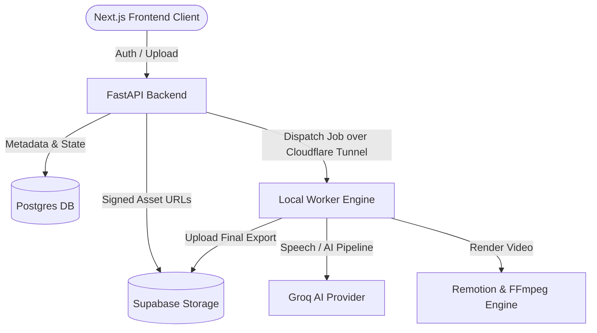
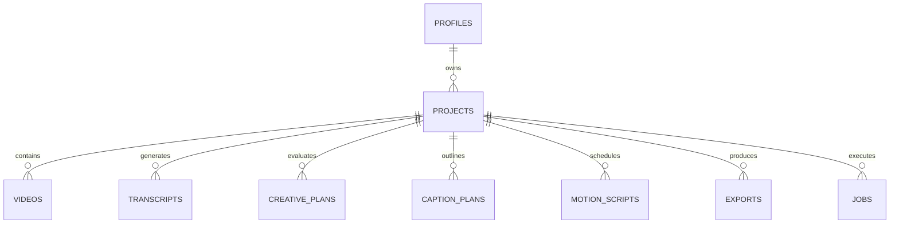

> **⚠️ SUPERSEDED by [CLAUDE.md](CLAUDE.md)** — kept for history until Phase 11. Do not follow the architecture below.

# MotionAI — Master Agent Reference & System Architecture (AGENTS.md)

> **All-In-One Unified Context**: This single file consolidates all project documentation, system architecture, database contracts, AI orchestration pipelines, local-worker tunnel setup, rendering guidelines, and deployment runbooks into a single source of truth.

---

## 🏛️ System Overview & Topology

**MotionAI** is an AI-powered video editing and subtitle captioning SaaS platform. It automates speech-to-text transcription, creative pacing analysis, subtitle timing, custom motion typography styling, and high-fidelity rendering.

### Core Architecture Tiers:
1. **Frontend**: Next.js 16 (React 19, TypeScript, TailwindCSS, Framer Motion, GSAP, Lenis, Phosphor/Lucide icons) communicating with Supabase Auth for identity management, and the FastAPI API for project state.
2. **Backend API**: FastAPI (Python 3.11) exposing secure endpoints, enforcing Redis sliding-window rate limits (`60 req/min`), managing PostgreSQL project state, and delegating jobs.
3. **Data & Storage Tier**: 
   - **PostgreSQL**: Relational database storing user profiles, projects, videos, transcripts, motion scripts, exports, and jobs.
   - **Supabase Storage**: Object storage container (`videos` bucket) hosting raw uploaded videos and final rendered export MP4s.
4. **Local-Worker Tunnel Processing Engine**:
   - Rather than relying on cloud rendering (which ran into free-tier RAM limits), **AI-pipeline and video rendering execute on user paired local computers** via `apps/backend/local_worker`.
   - The local worker runs a lightweight FastAPI service communicating over a **Cloudflare Quick Tunnel** with backend API proxying.
   - Local worker handles Groq speech-to-text, pacing analysis, ASS subtitle generation, and Remotion/FFmpeg rendering directly on the local GPU/CPU.

---

## 💾 Relational Data Schema Map

### Table Definitions:
- **`projects`**: `id`, `owner_id`, `title`, `description`, `status` (`draft` | `processing` | `ready` | `completed` | `failed`), `style` (`kalakar`, `minimal`, `emerald`, etc.), `caption_template`, `language`, `aspect_ratio` (`9:16`, `16:9`, `1:1`), `created_at`.
- **`videos`**: `id`, `project_id`, `storage_path`, `duration_ms`, `width`, `height`, `created_at`.
- **`transcripts`**: `id`, `project_id`, `language`, `provider`, `version`, `transcript_json` (Whisper word-level timings).
- **`creative_plans`**: `id`, `project_id`, `creative_plan` (Pacing, emphasis, hero words).
- **`caption_plans`**: `id`, `project_id`, `caption_json` (Styled word chunks & highlights).
- **`motion_scripts`**: `id`, `project_id`, `version`, `motion_script_json` (Renderer IR layout instructions).
- **`exports`**: `id`, `project_id`, `resolution`, `quality`, `storage_path`, `render_duration_ms`, `file_size`, `status` (`completed` | `expired`).
- **`jobs`**: `id`, `project_id`, `job_type` (`ai_pipeline` | `render`), `status` (`pending` | `processing` | `completed` | `failed`), `error_message`, `started_at`, `finished_at`.
- **`workers`**: `id`, `owner_id`, `worker_token`, `worker_url`, `status` (`online` | `offline`), `last_seen_at`, `last_error`.

---

## 🤖 AI Orchestration Pipeline

The AI pipeline converts raw speech into animated motion graphics through 4 contract-validated steps:

1. **Speech-to-Text (`GroqSpeechProvider`)**: Uses Groq Whisper API to produce word-level timestamps (`Transcript` contract).
2. **Creative Analysis (`CreativeProvider`)**: Evaluates pacing, tone, and identifies "hero words" / high-emphasis tokens (`CreativePlan` contract).
3. **Caption Planning (`CaptionProvider`)**: Formats text into timed display lines, applying template rules (`CaptionPlan` contract).
4. **MotionScript IR Generation (`StylePreset`)**: Translates caption plans into deterministic, frame-accurate rendering instructions (`MotionScript` contract).

---

## 🎬 Remotion & FFmpeg Subtitle Rendering Rules

- **Deterministic Remotion Engine**: React video components rendered frame-by-frame using `@remotion/player` in dev and `@remotion/renderer` in production.
- **ASS Subtitle Overlay**: For fast server-side rendering, `app/render/engine.py` converts `MotionScript` into `.ass` subtitle files and burns them into the video via FFmpeg filtergraphs.
- **Font & Animation Guidelines**:
  - Fonts must be loaded cleanly using local or Google Web Fonts.
  - Never place async data fetching or un-memoized calculations inside Remotion frame loops.
  - Use `interpolate()` or `spring()` from Remotion for fluid word animations.

---

## 🚀 Local Worker Pairing & Tunnel Setup

Users pair their local machines to execute heavy rendering jobs:

1. **Installation Script**:
   - **macOS / Linux**: `curl -fsSL https://captionseasy.vercel.app/install.sh | bash`
   - **Windows**: `irm https://captionseasy.vercel.app/install.ps1 | iex`
2. **Setup Mechanism**:
   - Downloads local worker service files into a hidden directory.
   - Installs Node 20+, `pnpm`, `ffmpeg`, and `cloudflared` if not present.
   - Launches a Cloudflare Quick Tunnel and outputs a `/pair?code=...` confirmation link.
3. **Dispatch Handling**:
   - When user clicks "Export" on Web UI, backend verifies worker is `online`.
   - Backend posts job payload to local worker over its tunnel URL.
   - If no worker is connected, backend immediately returns `NO_WORKER_PAIRED` (409) with UI prompt to connect computer.

---

## 🔒 API Contracts & Security

- **Authentication**: JWT token issued via Supabase Auth validated by FastAPI middleware on `/api/v1/*`.
- **Rate Limiting**: Redis-backed sliding window (`60 requests/min` per authenticated user).
- **Storage Access**: Supabase Storage bucket (`videos`) is private. Signed URLs with short expiration are generated on-demand for video streaming and downloads.
