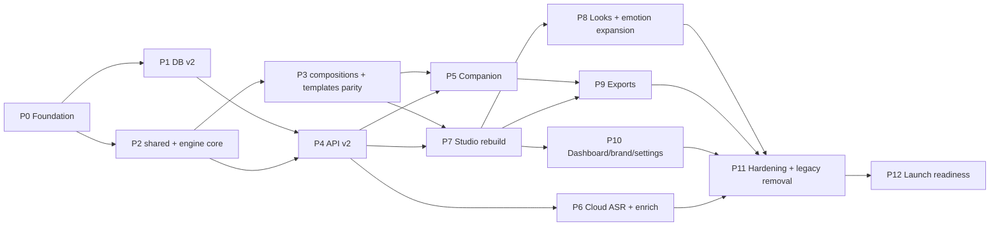

# CLAUDE.md — CapsEasy: Master Architecture & Orchestration Plan

> **Read this whole file before touching code.** It is the single source of truth for
> *what CapsEasy is*, *how it is wired*, *what is broken today*, and *the exact phased plan*
> to turn the repo into a complete, working product. It supersedes `AGENTS.md`, `README.md`,
> `comparision.md` wherever they disagree. `remotion.md` / `remotion2.md` remain reference
> material for Remotion text/motion techniques.
>
> Written: 2026-09-30. Status tracker is at the bottom (§17) — update it as phases land.

---

## 0. TL;DR for the implementing agent

1. **Topology target: Vercel + Supabase + the user's own PC. Nothing else.**
   No Render, no FastAPI, no Celery, no Redis, no Cloudflare tunnel. The Python backend
   (`apps/backend`) and `render.yaml` are **legacy** and get deleted in Phase 11.
2. **Heavy compute (Whisper transcription, Remotion rendering) runs on a local Node.js
   "Companion"** the user installs once. It **pulls** jobs from our API (outbound HTTPS
   only — no tunnel, works behind any NAT/firewall).
3. **Transcription = local `whisper.cpp` via `@remotion/install-whisper-cpp` (default, free,
   private)**, with **Groq Whisper as an optional cloud fallback** (both Groq keys in
   `apps/backend/.env` were verified live on 2026-09-30, models `whisper-large-v3` and
   `whisper-large-v3-turbo` available). Note: the provider is **Groq** (gsk_ keys), not xAI Grok.
4. **One composition, two surfaces.** The exact same React composition renders in the
   browser `<Player>` (preview) and in the Companion's `renderMedia()` (export). WYSIWYG is
   guaranteed by import, not by discipline.
5. **The editable truth is a `CaptionDoc`** (words + timing + manual breaks + per-word
   overrides + emotions), versioned with optimistic concurrency. Raw ASR transcripts are
   immutable inputs.
6. **Templates are declarative modules** (`layout + skin + motion + defaults + capabilities
   + emotionMap`). The 8 legacy layouts and 28 legacy looks are ported with visual parity,
   then expanded to ~50 looks across 12 layout families.
7. Work phase-by-phase (§14), run the **self-verification loop** (§15) after every task,
   and tick the status tracker (§17).

---

## 1. Product definition

**CapsEasy** turns a talking-head / short-form / podcast video into a captioned video with
animated, on-brand, emotionally-reactive captions in minutes — then lets the creator control
every word, frame, color and motion.

### 1.1 Core user journey (must work end-to-end, flawlessly)

```
Sign up → (optional) Pair Companion → New project → Drop video
 → instant probe (duration/aspect/codec) + upload with progress (resumable)
 → auto-transcribe (local Whisper, or cloud Groq) → auto-enrich (hero words, emoji, emotion)
 → Studio: pick a Look, tweak style, fix words/timing, drag position, preview at 60fps
 → Export: MP4 burned-in | transparent MOV/WebM overlay | SRT/VTT/ASS/TXT/JSON
 → Download / re-export / duplicate project / save look as my template
```

### 1.2 Personas & what they need

| Persona | Needs | Features that serve them |
|---|---|---|
| Shorts/Reels/TikTok creator | Viral looks, 1–3 words/card, speed | Viral looks, emoji auto, hero words, platform safe zones, 1-click export |
| Podcaster / long-form | Readable, low-motion, long files | Clean/podcast looks, 5–8 words/card, 2-line subtitle layout, SRT export, virtualization for 1h+ |
| Pro editor (Premiere/Resolve/FCP/CapCut) | Captions only, no re-encode | Transparent ProRes 4444 / WebM alpha overlay, SRT/ASS |
| Hinglish / Indian creators | Latin-script Hinglish, Devanagari optional | Romanization toggle, Devanagari-capable fonts, "Desi" looks |
| Brands / agencies | Consistency | Brand kits, saved templates, custom font upload |
| Accessibility-minded | Accurate, legible | SDH-style look, contrast warnings, profanity/filler controls |

### 1.3 Non-goals (for this build)

Full NLE editing (multi-track cutting), stock media, AI avatars, team workspaces, mobile app.
Schema should not preclude teams later (owner_id everywhere, no hard single-user assumptions).

---

## 2. Current-state audit (what exists, what is broken)

### 2.1 Repo map (as of commit `cdd7723` + uncommitted migration to Next API routes)

```
apps/frontend/            Next.js 16, React 19, Tailwind 4, TanStack Query, @remotion/player
  src/app/api/v1/**       NEW (uncommitted) Next route handlers replacing FastAPI — partial
  src/app/(dashboard)/    dashboard, projects/[id] (studio), settings
  src/components/project/ legacy studio pieces (SmoothCaptionOverlay rAF clock, Draggable…)
  src/config/captionTemplates.ts  8 templates + 12 presets (frontend mirror)
  src/remotion/CaptionComposition.tsx  Player composition (words → cards, 5-word limit hardcoded)
  src/utils/supabaseAdmin.ts          service-role client + getUserFromRequest (NEW)
apps/remotion-pipeline/   Remotion bundle: Subtitles, VideoWithCaptions (reads getInputProps)
apps/backend/             FastAPI + Celery + Alembic + Groq providers + render engine (Python)
  local_worker/           Python FastAPI worker behind Cloudflare Quick Tunnel
  app/render/presets.json 13 style presets (+ junk custom_* keys written to disk)
packages/caption-engine/  CaptionEngine.tsx — 1100-line monolith, shared by preview + render
packages/contracts/       JSON schemas + TS/Python contract types (MotionScript IR era)
.agents/skills/           remotion-best-practices (rules/*.md), supabase, postgres best practices
remotion.md, remotion2.md Remotion typography / ecosystem reference
```

### 2.2 Live Supabase project

- Project ref: **`sqalfzybuydgsaqocysb`** (region ap-northeast-2, Postgres 17). Matches
  `apps/frontend/.env.local` and `apps/backend/.env`.
- Tables (RLS enabled on all, but API bypasses RLS via service role): `profiles`(0 rows),
  `projects`(1), `videos`(4), `jobs`(5, enum `job_status` = queued|processing|completed|failed|cancelled,
  has `worker_id`), `transcripts`, `creative_plans`, `caption_plans`, `motion_scripts`,
  `exports`, `usage`, `workers`(1), `worker_pairings`(4), `alembic_version`.
- Storage: bucket `videos` (private).
- **CORRECTION (verified 2026-09-30):** the live DB holds REAL data — 9 auth users, 24 projects,
  6 workers (table stats from `list_tables` were stale). Migrations must stay additive/non-destructive.
  Legacy `projects.status` is still uppercase varchar (`COMPLETED`, `FAILED`, `PROCESSING`, `UPLOADED`);
  new code must treat status case-insensitively until P11 normalizes it.
- Identity is already unified: `profiles.id == auth.users.id` (P1 remap; FKs are `ON UPDATE CASCADE`).

### 2.3 Known bugs & blunders (fix or delete during the rebuild)

| # | Where | Problem | Resolution in plan |
|---|---|---|---|
| B1 | `projects/[id]/page.tsx` | Video URL hardcodes a **different** Supabase ref (`obxugkghzszatjmqoigf`) and a **public** URL for a **private** bucket → preview never loads | Signed URL from API (P4, P7) |
| B2 | studio page | Default template `"hormozi_block"` doesn't exist → silently falls to SentenceCard | Template registry with validation + fallback warning (P3) |
| B3 | studio page | Word edits live only in React state; **Export button does nothing** | CaptionDoc autosave + export flow (P4, P7, P9) |
| B4 | `api/v1/projects/[id]/motion-script` GET | **No ownership check (IDOR)** — any user can read any project's script | All routes via `withAuth` + RLS-scoped client (P4) |
| B5 | `api/v1/projects/[id]` PATCH | `update({...body})` → **mass assignment** (owner_id, status…) | zod allow-list schemas (P4) |
| B6 | `workers.worker_token` | Plaintext tokens, equality lookup | SHA-256 hash + prefix, constant-time compare (P1, P4) |
| B7 | process/export routes | Callback URL built from `Host` header (spoofable) | `APP_URL` env; pull model removes callbacks entirely (P5) |
| B8 | upload + process routes | Upload creates a `queued` job nobody runs; process creates another → duplicate/orphan jobs | Single enqueue with idempotency key (P4) |
| B9 | videos | `duration_ms/width/height/fps` never populated → Player defaults to 10 s | Browser probe (Mediabunny) + companion ffprobe verify (P4, P6) |
| B10 | auth | Dual identity (`owner_id in [profile.id, auth uid]`) | `profiles.id = auth.users.id`, trigger-created (P1) |
| B11 | root `package.json` | Mixed Remotion versions (4.0.484 vs ^4.0.529) → runtime "version mismatch" | Pin ALL `remotion`/`@remotion/*` to one exact version (P0) |
| B12 | CaptionEngine | `estimateTextWidthPx = len*size*0.56` → wrong wraps/clipping | `@remotion/layout-utils` measureText/fitText/fillTextBox (P3) |
| B13 | CaptionEngine | `const FPS = 30` hardcoded → wrong springs at 24/25/60 fps | fps from `useVideoConfig()` everywhere (P3) |
| B14 | remotion-pipeline | Components read `getInputProps()` instead of props → Player ≠ render | Props-only composition with zod schema (P3) |
| B15 | local worker | Python + whole backend import + Cloudflare Quick Tunnel (URL changes each restart, inbound, flaky) | Node Companion, pull model (P5) |
| B16 | `presets.json` | `custom_<uuid>` keys persisted to disk | User templates in Postgres (P1, P10) |
| B17 | `api-client.ts` | `NEXT_PUBLIC_API_URL` defaults to `http://localhost:8000/api/v1` | Relative `/api/v1` (P4) |
| B18 | `supabaseAdmin.ts` | Throws at import if env missing → breaks `next build` | Lazy getter, server-only module (P4) |
| B19 | `getUserFromRequest` | Network `auth.getUser` + profile upsert on every request | `@supabase/ssr` cookie session + `getClaims()`/`getUser()` once per request; profile via trigger (P4) |
| B20 | studio | rAF-clocked overlay (`SmoothCaptionOverlay`) + custom drag wrapper duplicates Player | Delete; Player + canvas overlay layer (P7) |

---

## 3. Target system architecture

### 3.1 Topology

```mermaid
graph LR
  subgraph Browser["Browser (Next.js client on Vercel CDN)"]
    UI[Studio / Dashboard]
    PL["@remotion/player<br/>CaptionedVideo composition"]
    MB[Mediabunny probe + audio extract]
  end

  subgraph Vercel["Vercel (Fluid Compute, Node runtime)"]
    RH["Route Handlers /api/v1/*<br/>(user API + worker API)"]
    CRON[Vercel Cron: storage GC]
    AFTER["after(): cloud transcribe / enrich"]
  end

  subgraph Supabase
    AUTH[Auth]
    PG[(Postgres + RLS + RPC + pg_cron)]
    ST[(Storage: media, fonts, brand)]
    RT[Realtime: jobs/projects/workers changes]
  end

  subgraph PC["User PC — CapsEasy Companion (Node 20+)"]
    LOOP[heartbeat + claim loop]
    WH[whisper.cpp]
    RR["@remotion/renderer renderMedia()"]
    FF[ffmpeg (Remotion-bundled)]
  end

  GROQ[(Groq API: Whisper + LLM)]

  UI -- session cookie --> RH
  UI -- TUS resumable upload (user JWT, RLS) --> ST
  UI <-- postgres_changes --> RT
  RH --> PG
  RH -- signed URLs --> ST
  AFTER --> GROQ
  LOOP -- "HTTPS (outbound only), worker token" --> RH
  LOOP -- signed GET/PUT --> ST
  CRON --> RH
  PG -- pg_cron lease reaper --> PG
```

### 3.2 Responsibilities (hard boundaries)

| Tier | Owns | Never does |
|---|---|---|
| **Browser** | UI, editor state, preview, probing, audio extraction, direct uploads, text exports (instant) | Holds service keys; trusts its own authz |
| **Vercel route handlers** | AuthN/Z, validation, job enqueue/claim/complete, signed URLs, cloud transcription/enrichment (short, via `after()`), text export persistence | Proxies video bytes; runs >300 s work; renders video |
| **Supabase Postgres** | Truth for all state, RLS, atomic job claiming (RPC), lease reaper (pg_cron), Realtime fan-out | Business logic that needs external calls |
| **Supabase Storage** | All binary objects, private, path-scoped RLS | Public exposure of user media |
| **Companion** | Whisper, rendering, proxy transcodes, heavy ffmpeg | Talks to Postgres directly; holds service keys |
| **Groq** | Optional cloud ASR + LLM enrichment | Required path (product works fully without it) |

### 3.3 Why a pull-based Companion (decision record)

- Vercel functions can't hold long renders; Supabase has no general compute; Render free tier
  OOM'd → compute must live on the user's machine (current product decision, kept).
- **Push** (current: API → tunnel → worker) needs an inbound URL (Cloudflare quick tunnels:
  random URL per restart, rate-limited, frequently broken, extra binary). **Pull** needs only
  outbound HTTPS → works behind NAT, corporate proxies, sleeps/wakes cleanly, zero extra binaries.
- Atomic claim via `FOR UPDATE SKIP LOCKED` → multiple companions per user are safe.
- Leases + pg_cron reaper → crashed/sleeping companions never strand jobs.

---

## 4. Monorepo layout (target)

```
apps/
  frontend/                      (keep name to avoid churn; Vercel project already linked)
    src/app/
      (marketing)/ page.tsx …    landing
      (auth)/ login, signup, forgot-password, reset-password, auth/callback
      (dashboard)/ dashboard, projects/[id] (studio), settings, templates, brand, companion
      pair/ page.tsx             device-code approval page
      api/v1/ …                  route handlers (§7)
      api/cron/ gc/route.ts      storage GC (Vercel Cron)
      install.ps1, install.sh    companion installers (rewrite for Node companion)
      companion/[file]/route.ts  serves companion tarball (or public/companion/*)
    src/features/
      studio/ (store, panels, timeline, canvas, player, shortcuts)
      dashboard/ upload/ exports/ templates/ companion/ settings/ brand/
    src/lib/
      supabase/ (browser.ts, server.ts, admin.ts [server-only])
      api/ (withAuth, withWorker, errors, validate, rateLimit)
      realtime/ (useJobChannel, useWorkerPresence)
packages/
  shared/            zod schemas + TS types (API DTOs, CaptionDoc, Style, Job payloads), plans/limits
  caption-engine/    PURE TS core (no React): segmentation, timing normalize, doc ops,
                     emphasis/emoji/emotion heuristics, exporters (srt/vtt/ass/txt/json), color utils
  templates/         React template framework + all template modules + motion library + fonts registry
  compositions/      Remotion Root + CaptionedVideo composition (+ OverlayOnly), calculateMetadata
  companion/         Node CLI "capseasy" (pairing, loop, whisper, render, proxy, doctor)
supabase/
  config.toml
  migrations/        timestamped SQL (source of truth for schema — replaces Alembic)
  seed.sql
  tests/             pgTAP or SQL assertions for RLS + claim RPC
```

**Dependency rule:** `shared` ← `caption-engine` ← `templates` ← `compositions` ← (`frontend`, `companion`).
No package imports "upward". `caption-engine` has zero React/Remotion imports (unit-testable in Node).

**Delete after parity (Phase 11):** `apps/backend`, `apps/remotion-pipeline`, `render.yaml`,
`packages/contracts` (MotionScript IR), `components/project/SmoothCaptionOverlay.tsx`,
`DraggableCaptionWrapper.tsx`, `config/captionTemplates.ts`, `app/test/*` (move useful demos to
a dev-only `/labs` route or delete), `graphify-out/`, root `output.mp4`, stray `.pyc`.

---

## 5. Data model — Postgres schema v2

All DDL lives in `supabase/migrations/*.sql`. Apply with Supabase MCP `apply_migration`
(or `supabase db push`). Follow `.agents/skills/supabase-postgres-best-practices` (lowercase
identifiers, FK indexes, `(select auth.uid())` in RLS, partial indexes, short transactions).

### 5.1 Identity

```sql
-- profiles.id == auth.users.id from now on (fixes B10)
-- migration: backfill a profile per auth user; re-point projects/workers/usage owner_id
--            from legacy profile ids to auth ids; then:
alter table profiles add column if not exists plan text not null default 'free';
alter table profiles add column if not exists preferences jsonb not null default '{}';
  -- { transcription_engine: 'auto'|'local'|'cloud', whisper_model: 'small'|..., default_look_id,
  --   ui: { timeline_zoom, panels }, romanize_hinglish: bool, default_platform: 'tiktok'|... }
alter table profiles add column if not exists onboarding jsonb not null default '{}';
create function public.handle_new_user() returns trigger language plpgsql security definer
  set search_path = '' as $$ begin
    insert into public.profiles (id, auth_user_id) values (new.id, new.id) on conflict do nothing;
    return new; end $$;
create trigger on_auth_user_created after insert on auth.users
  for each row execute function public.handle_new_user();
```

### 5.2 Projects & media

```sql
create type project_status as enum
  ('draft','uploading','processing','ready','rendering','failed','archived');
alter table projects
  add column status_v2 project_status not null default 'draft',     -- swap with status after backfill
  add column look_id text,                 -- preset/look chosen (e.g. 'hormozi_viral')
  add column template_id text,             -- layout template (e.g. 'sentence_highlight')
  add column style_json jsonb,             -- full CaptionStyleV2 (§6.3) — replaces custom_style_json
  add column platform text,                -- 'tiktok'|'reels'|'shorts'|'youtube'|'linkedin'|'podcast'|'custom'
  add column settings_json jsonb not null default '{}';  -- segmentation + language + filters (§6.4)
-- keep: title, description, language, aspect_ratio, archived_at, deleted_at, thumbnail_url
-- drop later: style, caption_template, fragment_overrides_json, custom_style_json

create type video_status as enum ('uploading','uploaded','processing','ready','failed');
alter table videos
  add column owner_id uuid references profiles(id),
  add column status video_status not null default 'uploading',
  add column original_filename text, add column mime_type text,
  add column video_codec text, add column audio_codec text, add column has_audio boolean,
  add column rotation int default 0, add column fps_num int, add column fps_den int,  -- VFR-safe
  add column preview_path text,            -- H.264 proxy when source isn't browser-playable
  add column audio_path text,              -- 16 kHz mono opus/webm for cloud ASR
  add column thumbnail_path text,
  add column probe_json jsonb, add column checksum text;
alter table videos alter column file_size type bigint;   -- already bigint; exports.file_size is int → fix
create index on videos(project_id); create index on videos(owner_id);
```

### 5.3 Transcripts & the editable CaptionDoc

```sql
-- transcripts: immutable raw ASR output (one row per ASR run)
alter table transcripts
  add column owner_id uuid, add column engine text,       -- 'whisper_cpp'|'groq'
  add column model text, add column duration_ms int,
  add column words_json jsonb;   -- normalized Word[] (§6.2) ; keep transcript_json raw

create table caption_documents (
  id uuid primary key default gen_random_uuid(),
  project_id uuid not null unique references projects(id) on delete cascade,
  owner_id uuid not null references profiles(id),
  source_transcript_id uuid references transcripts(id),
  revision int not null default 1,          -- optimistic concurrency
  doc jsonb not null,                        -- CaptionDoc (§6.2)
  updated_at timestamptz not null default now()
);
create table caption_document_versions (      -- snapshots: before reprocess / every 25 saves / manual
  id uuid primary key default gen_random_uuid(),
  document_id uuid not null references caption_documents(id) on delete cascade,
  owner_id uuid not null, revision int not null, reason text, doc jsonb not null,
  created_at timestamptz not null default now()
);
create index on caption_document_versions(document_id, created_at desc);

-- Atomic save with concurrency check (called by API; returns new revision or raises)
create function save_caption_doc(p_project uuid, p_expected int, p_doc jsonb)
returns int language plpgsql security invoker as $$
declare v int; begin
  update caption_documents set doc = p_doc, revision = revision + 1, updated_at = now()
   where project_id = p_project and revision = p_expected
   returning revision into v;
  if v is null then raise exception 'REVISION_CONFLICT' using errcode = 'P0001'; end if;
  return v; end $$;
```

### 5.4 Jobs (queue) — the heart of the system

```sql
create type job_kind as enum ('transcribe','enrich','render','proxy','thumbnail');
-- NOTE: no 'waiting_worker' enum value; UI derives it from status='queued' + no online worker
alter table jobs
  add column owner_id uuid references profiles(id),
  add column kind job_kind,                      -- replaces job_type text
  add column engine text not null default 'local',   -- 'local' (companion) | 'cloud' (Vercel after())
  add column payload jsonb not null default '{}',    -- immutable snapshot needed to execute
  add column result jsonb,
  add column stage text, add column message text,
  add column attempts int not null default 0, add column max_attempts int not null default 3,
  add column priority int not null default 0,
  add column run_after timestamptz not null default now(),
  add column lease_expires_at timestamptz,
  add column cancel_requested boolean not null default false,
  add column idempotency_key text,
  add column error_code text;
create unique index jobs_idem on jobs(project_id, idempotency_key) where idempotency_key is not null;
create index jobs_claim on jobs(owner_id, priority desc, created_at)
  where status = 'queued' and engine = 'local';
create index jobs_lease on jobs(lease_expires_at) where status = 'processing';

create table job_events (   -- append-only audit/progress log for debugging + UI timeline
  id bigint generated always as identity primary key,
  job_id uuid not null references jobs(id) on delete cascade,
  at timestamptz not null default now(), level text not null default 'info',
  stage text, progress int, message text, data jsonb
);
create index on job_events(job_id, at);

-- Atomic claim (service_role only)
create function claim_next_job(p_worker uuid, p_kinds job_kind[], p_lease_s int default 90)
returns setof jobs language plpgsql security definer set search_path = public as $$
declare w record; j jobs; begin
  select id, owner_id into w from workers where id = p_worker and revoked_at is null;
  if not found then return; end if;
  select * into j from jobs
   where owner_id = w.owner_id and status = 'queued' and engine = 'local'
     and kind = any(p_kinds) and run_after <= now() and not cancel_requested
   order by priority desc, created_at
   for update skip locked limit 1;
  if not found then return; end if;
  update jobs set status = 'processing', worker_id = p_worker, attempts = attempts + 1,
         started_at = coalesce(started_at, now()), lease_expires_at = now() + make_interval(secs => p_lease_s),
         updated_at = now()
   where id = j.id returning * into j;
  return next j; end $$;
revoke all on function claim_next_job from public, anon, authenticated;

-- Lease reaper + worker liveness (pg_cron, every minute)
select cron.schedule('capseasy-reaper', '* * * * *', $$
  update jobs set
     status = case when attempts >= max_attempts then 'failed'::job_status else 'queued'::job_status end,
     error_code = 'LEASE_EXPIRED', worker_id = null, lease_expires_at = null,
     run_after = now() + (least(attempts, 5) * interval '20 seconds'), updated_at = now()
   where status = 'processing' and lease_expires_at < now();
  update workers set status = 'offline' where status = 'online' and last_seen_at < now() - interval '45 seconds';
$$);
```

### 5.5 Workers (companions) & pairing

```sql
alter table workers
  add column token_hash text, add column token_prefix text,     -- 'cpe_ab12…' shown in UI
  add column platform text, add column version text,
  add column capabilities jsonb not null default '{}',
     -- { whisper: { installed, models:[...] }, gpu: 'nvidia'|'apple'|null, cpu_cores, ram_gb,
     --   disk_free_gb, chrome_ready, kinds:['transcribe','render','proxy'] }
  add column current_job_id uuid, add column revoked_at timestamptz;
-- after migration: drop worker_url, worker_token (plaintext)

create table device_codes (          -- replaces worker_pairings (RFC 8628-style device flow)
  user_code text primary key,        -- 'WXYZ-4821' human code shown in terminal + URL
  device_code_hash text not null unique,
  owner_id uuid references profiles(id),
  status text not null default 'pending',   -- pending|approved|denied|consumed|expired
  worker_name text, platform text,
  expires_at timestamptz not null, approved_at timestamptz, created_at timestamptz default now()
);
```

### 5.6 Exports, templates, brand, fonts, usage

```sql
create type export_kind as enum ('mp4','mov_alpha','webm_alpha','srt','vtt','ass','txt','json','png');
create type export_status as enum ('queued','rendering','ready','failed','expired','cancelled');
alter table exports
  add column owner_id uuid, add column job_id uuid references jobs(id),
  add column kind export_kind, add column status_v2 export_status default 'queued',
  add column settings jsonb not null default '{}',   -- {width,height,fps,crf,range:{startMs,endMs},codec}
  add column doc_revision int, add column expires_at timestamptz,
  alter column file_size type bigint;

create table user_looks (           -- "Save as my template"
  id uuid primary key default gen_random_uuid(),
  owner_id uuid not null references profiles(id) on delete cascade,
  name text not null check (char_length(name) between 1 and 60),
  template_id text not null, style_json jsonb not null, settings_json jsonb not null default '{}',
  thumbnail_path text, is_favorite boolean not null default false,
  created_at timestamptz default now(), updated_at timestamptz default now()
);
create table favorite_looks (owner_id uuid, look_id text, primary key (owner_id, look_id));
create table brand_kits (
  id uuid primary key default gen_random_uuid(), owner_id uuid not null references profiles(id) on delete cascade,
  name text not null, colors jsonb not null default '[]', font_ids jsonb not null default '[]',
  logo_path text, default_look_id text, created_at timestamptz default now()
);
create table user_fonts (
  id uuid primary key default gen_random_uuid(), owner_id uuid not null references profiles(id) on delete cascade,
  family text not null, weight int default 400, style text default 'normal',
  storage_path text not null, format text not null check (format in ('woff2','woff','ttf','otf')),
  created_at timestamptz default now()
);
create table usage_events (
  id bigint generated always as identity primary key,
  owner_id uuid not null, kind text not null,  -- 'upload_bytes'|'local_transcribe_s'|'cloud_transcribe_s'|'render_s'|'llm_tokens'|'export'
  amount bigint not null, project_id uuid, job_id uuid, created_at timestamptz default now()
);
create index on usage_events(owner_id, kind, created_at);
create view usage_month as select owner_id, kind, sum(amount) total
  from usage_events where created_at >= date_trunc('month', now()) group by 1,2;
```

Deprecated (stop writing in P4, drop in P11): `creative_plans`, `caption_plans`, `motion_scripts`,
`worker_pairings`, `usage` (replaced by `usage_events`), `alembic_version`.

### 5.7 RLS (every table)

Pattern (owner-scoped; use `(select auth.uid())` for per-statement caching):

```sql
create policy "own rows" on projects for all to authenticated
  using (owner_id = (select auth.uid())) with check (owner_id = (select auth.uid()));
```

Apply to: projects, videos, transcripts, caption_documents, caption_document_versions, jobs
(select + insert only for users; updates by service role), job_events (select via job owner),
exports, user_looks, favorite_looks, brand_kits, user_fonts, usage_events (select only),
workers (select + update `name`/`revoked_at` only), profiles (self). `device_codes`: no user
policies (service role only). Add FK indexes on every `owner_id`/`project_id`.

Realtime: `alter publication supabase_realtime add table jobs, projects, workers, exports;`
(postgres_changes honors RLS → users only receive their own rows).

### 5.8 Storage layout & policies

| Bucket | Visibility | Path | Written by |
|---|---|---|---|
| `media` | private | `{uid}/{projectId}/source/{videoId}.{ext}` | browser (TUS, user JWT) |
|  |  | `{uid}/{projectId}/preview/{videoId}.mp4` | companion (signed upload) |
|  |  | `{uid}/{projectId}/audio/{videoId}.webm` | browser |
|  |  | `{uid}/{projectId}/thumbs/{videoId}.jpg` | browser |
|  |  | `{uid}/{projectId}/exports/{exportId}.{ext}` | companion / API |
| `fonts` | private | `{uid}/{fontId}.{ext}` | browser |
| `brand` | private | `{uid}/{kitId}/logo.{ext}` | browser |
| `videos` (legacy) | private | read-only until P11 migration/deletion | — |

Policy: `(storage.foldername(name))[1] = (select auth.uid())::text` for select/insert/update/delete.
Bucket `file_size_limit` + `allowed_mime_types` set per bucket.

> ⚠️ **Plan limit edge case:** Supabase Free caps per-file size (historically 50 MB). Real
> creator videos exceed this. Before P4, check the project's storage settings; if on Free,
> either (a) upgrade to Pro (global limit configurable up to large sizes) — **recommended**, or
> (b) enforce a 50 MB cap in UI with a clear message + suggest compress. Exports face the
> same limit. This is the #1 production footgun — verify it first.

---

## 6. Core domain contracts (`packages/shared`)

All contracts are **zod schemas** exported with inferred types; used by API validation,
editor store, Remotion composition `schema`, and companion payload parsing.

### 6.1 Units & coordinate system (decided, do not deviate)

- **Time:** integer milliseconds everywhere in data. Frames only inside Remotion:
  `frame = Math.round(ms / 1000 * fps)`; never hardcode 30.
- **Position:** normalized `x,y ∈ [0,1]` of the frame (center of caption block), so aspect-ratio
  changes and 720p/4K renders stay correct.
- **Size:** `fontSize` stored in **reference px at 1080 short-edge**; rendered size =
  `fontSize * min(width,height) / 1080`. Same for stroke, shadow offsets, padding, radii.
- **Safe box:** `{ top, bottom, left, right }` as fractions of frame (0–0.5).

### 6.2 `CaptionDoc` v2

```ts
Word = {
  id: string;              // stable nanoid — edits/overrides key off this, never array index
  text: string;            // display text (user-editable)
  startMs: number; endMs: number;   // normalized: monotonic, endMs > startMs, min 40ms
  confidence?: number;     // ASR confidence 0-1 (low-confidence underline in editor)
  hidden?: boolean;        // filler/profanity removed or user-hidden (kept for timing)
  emphasis?: 'none' | 'strong' | 'hero';   // hero = the card's star word
  color?: string;          // per-word color override
  emoji?: { char: string; position: 'before'|'after'|'above' } | null;
  source?: { text: 'asr'|'user'; emphasis?: 'ai'|'heuristic'|'user'; emoji?: 'ai'|'user' };
}
Card = {                   // only MANUAL structure is stored; automatic pages are derived
  id: string;
  firstWordId: string; lastWordId: string;
  emotion?: Emotion; emotionSource?: 'ai'|'heuristic'|'user';
  position?: { x: number; y: number } | null;     // per-card override
  styleOverride?: Partial<CaptionStyleV2> | null;
  locked?: boolean;         // user-made break: segmentation must respect
}
CaptionDoc = {
  version: 2;
  language: string;         // BCP-47 ('en', 'hi', 'hi-Latn' for romanized Hinglish)
  direction: 'ltr' | 'rtl';
  words: Word[];
  manualBreaks: string[];   // word ids that START a new card (user "split here")
  noBreakAfter: string[];   // word ids after which a break is forbidden (user "merge")
  cards: Record<string, Pick<Card,'emotion'|'emotionSource'|'position'|'styleOverride'>>; // keyed by first word id
  meta: { userEdited: boolean; createdFromTranscriptId?: string; enrichedAt?: string };
}
Emotion = 'neutral'|'excited'|'funny'|'serious'|'sad'|'angry'|'surprised'|'question'|'hype'|'calm'
```

**Derivation (pure, memoized, in `caption-engine`):**
`segment(doc, settings) → Page[]` where `Page = { id, startMs, endMs, words: Word[], lines: Word[][], heroIndex, emotion, position, style }`.
Rules in order: hidden words skipped (their time folds into neighbors) → manual breaks →
noBreakAfter → sentence end (`.!?` / `।` / `？`) → pause gap > `pauseMs` → max words →
max chars per line × max lines (measured with real font metrics via `measure` callback injected
from `templates`, fallback to char-count in pure tests) → min card duration (merge tiny tail) →
clamp: `page.endMs = min(max(lastWord.endMs + holdMs, …), nextPage.startMs)` → pages never overlap.
Hero index: user `hero` > AI `hero` > heuristic (`pickKeywordIndex` from legacy, extended with
numbers, ALL-CAPS, long nouns, stoplists per language).

### 6.3 `CaptionStyleV2` (the full control surface)

```ts
CaptionStyleV2 = {
  templateId: string;
  // Typography
  fontId: string; fontWeight: number; fontStyle: 'normal'|'italic';
  fontSize: number;                     // ref px @1080
  casing: 'none'|'upper'|'lower'|'title'|'sentence';
  letterSpacing: number; wordSpacing: number; lineHeight: number;
  align: 'left'|'center'|'right';
  maxWidth: number;                     // fraction of frame width (0.3–1)
  // Fill
  fill: { type: 'solid'; color } | { type: 'gradient'; stops: {color, at}[]; angle } ;
  inactiveOpacity: number;              // for karaoke/minimal (dim not-yet-spoken words)
  // Hero/secondary text (independent — legacy "Phase D")
  hero: { fontId?; fontWeight?; scale: number; fill?; stroke?; casing?; rotate?: number };
  // Active word (the word being spoken)
  active: { effect: ActiveEffect; color: string; scale: number; boxColor?: string; boxRadius?: number };
  // Stroke / shadow / glow
  stroke: { enabled; width; color; };
  shadows: { x; y; blur; color }[];     // multi-layer (enables hard 3D shadow, extrusions)
  glow: { enabled; color; radius; intensity };
  // Background
  background: { type: 'none'|'pill'|'box'|'bar'|'word-box'|'bubble'; color; opacity; padding; radius; blur };
  // Layout & placement
  position: { x: number; y: number };   // normalized; default y≈0.72 (above platform UI)
  safeBox: { top; bottom; left; right };
  rotation: number;
  // Motion
  entrance: { type: EntranceType; durationMs: number; stagger: 'none'|'word'|'char'; easing: EasingId };
  exit: { type: ExitType; durationMs: number };
  motionIntensity: number;              // 0–2 global multiplier (springs, offsets)
  emotionReactivity: number;            // 0–1 how strongly emotions alter look (§8.5)
  // Emoji
  emoji: { enabled: boolean; size: number; animation: 'pop'|'float'|'spin'|'none' };
  // Template-specific knobs (validated by the template's own zod schema)
  templateOptions: Record<string, unknown>;
}
ActiveEffect = 'none'|'color'|'pop'|'box'|'underline'|'marker'|'glow'|'bounce'|'shake'|'fill-sweep'|'scale-up'|'outline-fill'
EntranceType = 'none'|'fade'|'rise'|'drop'|'pop'|'zoom'|'slide-left'|'slide-right'|'blur-in'|'typewriter'|'wave'|'flip'|'elastic'|'glitch'|'mask-reveal'
ExitType = 'none'|'fade'|'fall'|'zoom-out'|'blur-out'|'slide-up'
```

Style resolution order (deep merge): template defaults → look defaults → brand kit →
project `style_json` → card `styleOverride` → per-word overrides → emotion modifiers.

### 6.4 `ProjectSettings` (segmentation, language, filters)

```ts
{ platform, maxWordsPerCard: 1–12, maxLines: 1–3, maxCharsPerLine: 8–60,
  pauseMs: 150–1500, holdMs: 0–1500, minCardMs: 200–2000, gapBehavior: 'hold'|'clear',
  syncOffsetMs: -1000–1000,           // global nudge (fixes systematic ASR lag)
  removeFillers: boolean, fillerList: string[], profanity: 'off'|'mask'|'emoji'|'hide',
  customVocabulary: string[],         // brand names → Whisper prompt + find/replace
  romanize: boolean,                  // Hinglish → Latin script
  language: 'auto'|BCP47, translateTo?: BCP47 | null, bilingual: boolean }
```

Platform presets (`packages/shared/platforms.ts`) set aspect, safe zones (TikTok right-rail
+ bottom caption bar, Reels, Shorts), default words/card, default y position.

### 6.5 Job payloads (discriminated union on `kind`)

```ts
TranscribeJob = { kind:'transcribe', videoId, engine:'local'|'cloud', model, language, prompt, romanize }
EnrichJob     = { kind:'enrich', documentRevision, features:['hero','emoji','emotion','fillers'] }
RenderJob     = { kind:'render', exportId, format:'mp4'|'mov_alpha'|'webm_alpha'|'png',
                  width, height, fps, crf, range?, docSnapshot: CaptionDoc, style: CaptionStyleV2,
                  settings: ProjectSettings, fonts: FontRef[], sourceVideoId }
ProxyJob      = { kind:'proxy', videoId, targetHeight: 720 }
```
Render payload **snapshots** doc + style at enqueue time → later edits never change an
in-flight render; `exports.doc_revision` records what was rendered.

---

## 7. API surface (Next.js route handlers, `/api/v1`)

### 7.1 Conventions

- Runtime: Node (Fluid Compute). `export const maxDuration = 300` only where needed.
- Auth: `@supabase/ssr` cookie session. `withAuth(handler)` → `{ user, supabase }` where
  `supabase` is the **user-scoped client (RLS enforced)**. Service-role client (`lib/supabase/admin.ts`,
  `import 'server-only'`, lazy init) is used **only** in worker routes, cron, and the few
  privileged steps (signed upload URLs for companion, claim RPC).
- `withWorker(handler)` → parses `Authorization: Bearer cpe_…`, sha256 → lookup `workers.token_hash`,
  rejects revoked, updates `last_seen_at` (throttled), returns `{ worker }`.
- Every body/query validated with zod from `packages/shared`. Unknown keys stripped.
- Envelope: `{ ok: true, data }` | `{ ok: false, error: { code, message, details? } }`; stable
  error codes (`UNAUTHORIZED, FORBIDDEN, NOT_FOUND, VALIDATION, CONFLICT, REVISION_CONFLICT,
  LIMIT_EXCEEDED, NO_COMPANION, UNSUPPORTED_MEDIA, UPSTREAM_FAILED, RATE_LIMITED, INTERNAL`).
- Idempotency: mutating endpoints that enqueue accept `Idempotency-Key` header → `jobs.idempotency_key`.
- Rate limit: cheap Postgres counter function for expensive endpoints (cloud transcribe,
  enrich, export) + optional Vercel Firewall rate-limit rule. No Redis.

### 7.2 User endpoints

| Method & path | Purpose |
|---|---|
| `GET /me` | profile, plan, limits, usage_month, preferences |
| `PATCH /me/preferences` | transcription engine, whisper model, defaults |
| `GET /projects?status&q&cursor` | list (keyset pagination), thumbnails as signed URLs |
| `POST /projects` | create `{title?, platform?, lookId?}` |
| `GET /projects/:id` | project + video(signed preview URL) + doc + latest jobs + exports |
| `PATCH /projects/:id` | allow-list: title, description, platform, lookId, templateId, style_json, settings_json, language, aspect_ratio |
| `DELETE /projects/:id` | soft delete → cancel jobs → schedule storage GC |
| `POST /projects/:id/duplicate` · `/archive` · `/unarchive` | |
| `POST /projects/:id/videos` | `{filename,size,mime,probe}` → validates limits/codec → returns `{videoId, bucket, path, resumable:{endpoint}}` |
| `POST /videos/:id/complete` | verify object exists + size → status uploaded → enqueue proxy (if needed) + transcribe (engine resolved §9.2) |
| `POST /videos/:id/audio-complete` | browser-extracted audio uploaded → enables cloud ASR |
| `POST /projects/:id/transcribe` | re-run ASR `{engine?, model?, language?}` — if `doc.meta.userEdited` require `{confirmReplace:true}`; snapshots old doc |
| `GET /projects/:id/document` | `{revision, doc}` |
| `PUT /projects/:id/document` | `{expectedRevision, doc}` → `save_caption_doc` → 409 `REVISION_CONFLICT` with server copy |
| `GET/POST /projects/:id/document/versions` · `POST …/versions/:vid/restore` | history |
| `POST /projects/:id/enrich` | AI hero/emoji/emotion (cloud) — respects `source:'user'` fields |
| `POST /projects/:id/exports` | `{kind, width?, height?, fps?, crf?, range?}` → text kinds: generate + store + return signed URL now; video kinds: enqueue render job (works even if companion offline → `waiting_worker`) |
| `GET /projects/:id/exports` · `GET /exports/:id/download` (fresh signed URL, `download=` filename) · `DELETE /exports/:id` | |
| `POST /jobs/:id/cancel` · `POST /jobs/:id/retry` | |
| `GET/POST/PATCH/DELETE /looks` (user looks) · `POST /looks/:id/favorite` | |
| `GET/POST/DELETE /brand-kits`, `/fonts` (+ upload URL) | |
| `GET /workers` · `PATCH /workers/:id` (rename) · `DELETE /workers/:id` (revoke) | |
| `POST /device/approve` `{userCode}` · `POST /device/deny` | from `/pair` page |

### 7.3 Companion (worker) endpoints — `Authorization: Bearer cpe_…`

| Method & path | Purpose |
|---|---|
| `POST /device/start` (unauth) | `{workerName, platform, version}` → `{userCode, deviceCode, verificationUrl, interval, expiresIn}` |
| `POST /device/token` (unauth) | `{deviceCode}` → `authorization_pending` / `{workerId, token}` once approved (token shown once; stored hashed) |
| `POST /worker/heartbeat` | `{version, capabilities, currentJobId}` → `{ok, minVersion, config, cancelJobIds[]}` |
| `POST /worker/jobs/claim` | `{kinds}` → `204` or `{job, urls:{sourceGet, previewPut?, exportPut?}}` (short-lived signed URLs) |
| `POST /worker/jobs/:id/progress` | `{stage, progress, message}` → extends lease → `{cancelRequested}` |
| `POST /worker/jobs/:id/urls` | refresh expired signed URLs mid-job |
| `POST /worker/jobs/:id/complete` | `{result}` (transcribe: words+meta; render: `{path,size,durationMs,renderMs}`) — idempotent |
| `POST /worker/jobs/:id/fail` | `{errorCode, message, retryable}` |

Server validates on every worker call: job belongs to `worker.owner_id` **and** `jobs.worker_id = worker.id`
**and** status is `processing` (stale companion after lease expiry gets `409 LEASE_LOST` and must drop work).

### 7.4 Cron

- pg_cron (Supabase): lease reaper + worker offline (every minute); expire exports older than
  plan retention (daily, sets status `expired`).
- Vercel Cron `GET /api/cron/gc` (daily, `CRON_SECRET` header): delete storage objects for
  expired exports, soft-deleted projects older than 7 days, orphaned uploads (`uploading` > 24 h).

---

## 8. Caption engine, templates & motion system

Read before implementing: `.agents/skills/remotion-best-practices/rules/`
`display-captions.md, subtitles.md, text-animations.md, timing.md, measuring-text.md,
google-fonts.md, local-fonts.md, videos.md, calculate-metadata.md, parameters.md,
transparent-videos.md, compositions.md, sequencing.md` and `remotion.md` §2 golden rules.

### 8.1 Golden rules (enforced in review)

1. Everything visual is a pure function of `frame` (+ props). No CSS transitions/keyframes,
   no Tailwind `animate-*`, no timers, no `Date.now()`, no `Math.random()` (use `random(seed)` from remotion).
2. fps comes from `useVideoConfig()`. Never a constant.
3. Fonts load via `@remotion/google-fonts/<Family>` `loadFont()` (or `@remotion/fonts` for user
   fonts) and gate rendering with `delayRender`/`continueRender` until `waitUntilDone()`.
   Measurement (`@remotion/layout-utils`) only after fonts are ready.
4. Heavy derivation (`segment`, measurement, style resolution) memoized with `useMemo` keyed
   on inputs; never inside per-frame loops.
5. Each page mounts in its own `<Sequence from durationInFrames layout="none">` — cheap frames.
6. Per-char animation uses `inline-block` spans with opacity/transform only after measuring
   line breaks on the whole string (avoid kerning jumps), or string slicing for typewriter.
7. Emoji render through a bundled color emoji font (Noto Color Emoji) so Windows/mac/Linux
   renders match the preview.

### 8.2 Composition contract (`packages/compositions`)

```tsx
<Composition id="CaptionedVideo" component={CaptionedVideo} schema={CaptionedVideoProps}
  calculateMetadata={calcMeta} fps={30} width={1080} height={1920} durationInFrames={1} />
<Composition id="CaptionsOverlay" … />   // same, no video, transparent background (alpha exports)
<Still id="CaptionStill" … />            // thumbnails / look previews

CaptionedVideoProps = { src: string|null; mediaMeta: {width,height,fps,durationMs,rotation};
  doc: CaptionDoc; style: CaptionStyleV2; settings: ProjectSettings; fonts: FontRef[];
  mode: 'burn'|'overlay'; range?: {startMs,endMs}; showSafeZones?: boolean /* preview only */ }
```

- `calculateMetadata` → `durationInFrames = ceil(durationMs/1000*fps)`, width/height from media
  (even-ized for H.264), fps = source fps rounded (VFR → 30), plus `defaultCodec`/pixel format
  for overlay mode (ProRes 4444 `yuva444p10le` / VP9 `yuva420p`, `imageFormat: 'png'`).
- Video layer: `<OffthreadVideo>` in render, `<Video>`-equivalent in Player (Remotion swaps
  automatically); `objectFit: 'contain'` on black, respect rotation.
- Preview uses the same component with `src = previewUrl ?? sourceUrl`.

### 8.3 Template framework (`packages/templates`)

```ts
defineTemplate({
  id: 'sentence_highlight', name, category, tags, version: 1,
  layout: 'sentence',                       // one of the layout families below
  defaults: Partial<CaptionStyleV2>, settingsDefaults: Partial<ProjectSettings>,
  optionsSchema: z.object({...}),           // template-specific knobs → auto-rendered controls
  capabilities: { hero, align, activeEffects:[...], entrances:[...], background:[...], emoji, maxLines },
  emotionMap: Partial<Record<Emotion, EmotionModifier>>,
  fonts: ['Anton','Montserrat:900'],        // preloaded
  Page: React.FC<PageRenderProps>,          // renders one page given local frame
})
```

The Style panel is **generated from `capabilities` + `optionsSchema`** → controls that do
nothing for a template are hidden (legacy `capabilities` idea, now enforced).

**Layout families** (renderers; each is a component in `packages/templates/layouts/`):

| Layout | Description | Legacy source |
|---|---|---|
| `sentence` | Words flow & wrap (fillTextBox), active-word effect | SentenceCard |
| `word` | One word owns the frame, pops per beat | WordByWordCard |
| `stack3` | Body line / giant hero / body line, splash anchoring | ThreeLineStack + 5 skins |
| `karaoke` | Full line, progressive fill sweep through words | new |
| `boxed` | Active word gets a solid rounded box (Hormozi/Submagic) | new |
| `typewriter` | Char-sliced reveal + deterministic blinking cursor | new |
| `bar` | Classic subtitle / lower-third bar, 1–2 lines, SDH-ready | new |
| `bubble` | Chat bubble (iMessage/WhatsApp) with tail | new |
| `kinetic` | Words placed at varied scale/rotation by emphasis (kinetic typography) | new |
| `teleprompter` | Current line bright, next line dimmed below | new |
| `dual` | Bilingual: original + translation lines | new |
| `highlighter` | Marker swipe behind hero/strong words | new |

**Motion library** (`packages/templates/motion/`): entrance, exit, active-effect functions
`(localFrame, fps, intensity, params) → CSSProperties` built on `interpolate`, `spring`,
`Easing`, `interpolateColors`, `random(seed)`. Spring presets: `snappy {damping:14,stiffness:220}`,
`bouncy {damping:9,stiffness:180}`, `smooth {damping:26,stiffness:120}`, `punch {damping:11,stiffness:240}`.

### 8.4 Look catalog (Looks = template + tuned defaults)

**A. Legacy — port with pixel parity (golden stills compared before/after, §15):**

Templates (8): `staggered_3line`, `glow_stack`, `cartoon_stack`, `serif_pop`, `cinematic_emerald`,
`word_by_word`, `sentence_highlight`, `sentence_clean` — exact skin values are in
`packages/caption-engine/src/CaptionEngine.tsx` `STACK_SKINS` + card components; defaults in
`apps/frontend/src/config/captionTemplates.ts` `TEMPLATE_STYLES`.

Looks from frontend presets (12): `hormozi_viral`, `mrbeast_punch`, `cyber_neon`, `tiktok_pop`,
`minimal_luxe`, `vintage_cinematic`, `bold_impact`, `staggered_splash`, `staggered_classic`,
`glow_stack_classic`, `serif_pop_classic`, `cartoon_stack_classic` (values in `PRESETS_LIST`).

Looks from backend style presets (13, `apps/backend/app/render/presets.json`): `minimal` (Inter,
fade), `modern` (Outfit, #FFFF00 pop), `podcast` (Inter, green/yellow, slide), `documentary`
(Cinzel #F5F5DC, fade), `viral_shorts` (Outfit #FFEA00 scale), `educational` (Outfit #E0F7FA /
#FF4081 pop), `luxury` (Cinzel / #D4AF37 fade), `formal` (Georgia→"Libre Baskerville" / #D4B96A),
`sarcastic` (Impact→"Anton" / #FF5E3A rotate), `humorous_tech` (Consolas→"JetBrains Mono" / #39FF8C),
`humorous_non_tech` (Comic Sans→"Comic Neue" / #FFB200 bounce), `kalakar` (Outfit / #C5FF00 pop),
`kalakar_shadow` (kalakar + hard shadow). System fonts are replaced with Google equivalents so
renders are deterministic. Ignore `custom_<uuid>` keys (junk).

**B. New looks (build in P8)** — each needs: defaults, fonts, emotionMap, golden still.

| id | Name | Category | Layout | Fonts | Palette | Active effect / motion |
|---|---|---|---|---|---|---|
| `hormozi_box` | Hormozi Box | Viral | boxed | Montserrat 900, upper | white / box #22C55E | box snaps word-to-word, pop 1.08 |
| `beast_bounce` | Beast Bounce | Viral | word | Luckiest Guy | #FFF200 / white, 6px black stroke, 0 8px 0 black shadow | punch spring, rotate ±3° alternating |
| `karaoke_fill` | Karaoke Fill | Viral | karaoke | Poppins 800 | white → #FFD400 | fill-sweep through word duration |
| `submagic_clean` | Pop Clean | Viral | sentence | Poppins 800 | white / #FF3B6B | scale-up 1.15 + color, stagger rise |
| `gradient_pop` | Gradient Pop | Viral | word | Poppins 900 | hue-shifting gradient (interpolateColors over time) | pop |
| `emoji_react` | Emoji React | Viral | sentence | Nunito 900 | white / #FFC700 | auto emoji pops above card, float |
| `comic_burst` | Comic Burst | Fun | word | Bangers | yellow on red starburst SVG behind hero | punch + 6° tilt |
| `wave_bounce` | Wave | Fun | sentence | Fredoka 700 | white / #7CFFB2 | per-char wave on active word |
| `storytime_soft` | Storytime | Fun | sentence | Nunito 800 | pastel per-word pills | gentle rise, word-box pastel |
| `imessage_bubble` | Chat Bubble | Fun | bubble | Inter 600 | #0A84FF bubble / white text | bubble pop-in with tail |
| `ali_minimal` | Minimal Pro | Clean | sentence | Inter 600 | inactive #9CA3AF, active white, blur pill | scale 1→1.04, smooth |
| `netflix_sub` | Subtitle | Clean/Access | bar | Inter 500 | white, soft shadow, no motion | none (SDH-ready, 2 lines) |
| `lower_third` | Broadcast | Clean | bar | Roboto Condensed 700 | navy bar + accent strip | slide-left in, fade out |
| `teleprompter` | Teleprompter | Podcast | teleprompter | Inter 700 | current white, next 35% | line slide-up |
| `podcast_duo` | Podcast Duo | Podcast | sentence | Manrope 800 | white / speaker accent | color, 2 lines, low motion |
| `luxe_serif` | Luxe Serif | Luxury | sentence | Cormorant Garamond 600 italic | ivory / champagne #E5C158 | mask-reveal, slow ease |
| `motivational` | Motivational | Cinematic | word | Bebas Neue | white, letter-spacing 0.5em→0.1em | fade + tracking tighten, optional letterbox |
| `film_noir` | Noir | Cinematic | sentence | Playfair Display 700 | white on 40% black bar, grain overlay | blur-in |
| `retro_vhs` | VHS | Retro | sentence | VT323 | white, RGB split shadows | deterministic 1-frame jitter every ~40 frames |
| `retro_3d` | Retro 3D | Retro | word | Rubik Mono One | #FF5CA8 with 8-layer extrusion shadow | drop + bounce |
| `neon_sign` | Neon | Retro | sentence | Tilt Neon | #FF2BD6 glow / #00F0FF | flicker entrance (seeded) + glow pulse |
| `terminal` | Terminal | Tech | typewriter | JetBrains Mono | #00FF66 on none, scanlines | typewriter + ▌ cursor 15f, glitch |
| `gaming_hud` | Gaming HUD | Gaming | boxed | Russo One | skewX(-8°) boxes #7C3AED / #22D3EE | shake on hype |
| `highlighter` | Highlighter | Education | highlighter | Lexend 700 | black text on white card, marker #FDE047 | marker swipe on hero |
| `edu_callout` | Explainer | Education | sentence | Lexend 800 | white / #38BDF8 underline | underline sweep + keyword chip |
| `outline_fill` | Outline Fill | Viral | sentence | Archivo Black | hollow (stroke only) → filled when spoken | outline-fill |
| `kinetic_mix` | Kinetic | Cinematic | kinetic | Anton + Inter | white / accent | scale by emphasis, rotate hero −6° |
| `desi_bold` | Desi Bold | Regional | stack3 | Baloo 2 800 (Devanagari-capable) + Anton | saffron #FF9933 / white / green #138808 | pop, Hinglish-friendly |
| `desi_clean` | Desi Clean | Regional | sentence | Mukta 700 | white / #FFB703 | color, romanized or Devanagari |
| `bilingual` | Bilingual | Global | dual | Inter 700 + Inter 500 | white / 70% white | fade |

Result: 8 templates → **~12 layouts, ~58 looks** (28 legacy + 30 new). Gallery groups by
category with search, favorites, "Recently used", and "My looks".

### 8.5 Emotion engine ("captions that feel what's said")

- **Detection** (per page): cloud LLM (Groq, model from `GROQ_ENRICH_MODEL` env, JSON mode,
  zod-validated, batched ≤150 pages/call, temperature 0) returns `{pageIndex, emotion, heroWordIndex,
  emoji?}`; **heuristic fallback** always available offline: punctuation (`!`→excited, `?`→question),
  lexicon lists per emotion (en + Hinglish), ALL-CAPS/number → hype, laughter tokens → funny.
- **Application:** each template's `emotionMap[emotion]` → `{ accentColor?, activeEffect?,
  motionIntensity×, entrance?, emoji?, shake? }`, scaled by `style.emotionReactivity` (0 = off).
  Defaults: excited→bigger pop + warm accent; funny→bounce + 😂-class emoji; angry→shake + red;
  sad→slow fade + desaturate; surprised→zoom + 😮; question→tilt + "?" accent; serious/calm→reduce motion.
- **Control:** per-card emotion chip in the captions list (user override → `emotionSource:'user'`,
  never overwritten by re-enrich); global reactivity slider; "Apply AI emotions" button.

### 8.6 Text measurement & fitting

`packages/templates/measure.ts` wraps `@remotion/layout-utils`:
`measureText` (word widths, cached by `font|weight|size|text`), `fitText` (shrink hero to width),
`fillTextBox` (line breaking honoring maxLines). Segmentation receives a `measureLine` callback
so card breaking uses real metrics. Validate font availability first (`validateFontIsLoaded`).

### 8.7 Scripts & language edge cases

- RTL (ar, he, ur, fa): `direction:'rtl'`, reverse splash anchoring, `unicode-bidi: plaintext`.
- CJK/Thai (no spaces): split tokens with `Intl.Segmenter(lang,{granularity:'word'})`; no trailing spaces.
- Devanagari/Bengali/Tamil: font fallback stacks with Noto Sans <Script>; stroke widths reduced
  (matras clip with thick strokes).
- Hinglish romanization: Whisper prompt hint (legacy `ROMANIZATION_PROMPT_HINT`) + deterministic
  JS transliteration fallback (e.g. `any-ascii`) for non-Latin tokens when `romanize=true`.
- Emoji & symbols: never uppercase-transform emoji; keep as separate `inline-block`.

---

## 9. Pipelines (step-by-step with edge cases)

### 9.1 Upload

1. User drops file → client validation (ext + MIME + size vs plan) → **Mediabunny probe**:
   duration, width/height, rotation, fps (detect VFR), video/audio codecs, hasAudio.
2. Playability check: `video.canPlayType(mime; codecs)` → if not playable (HEVC on Windows
   Chrome, ProRes, some MKV) → mark `needsProxy`.
3. Aspect auto-detect → suggest platform/aspect (user can change).
4. `POST /projects/:id/videos` → `{videoId, path}` (server re-validates, checks storage quota).
5. **TUS resumable upload** (`tus-js-client`, 6 MB chunks, user JWT, `x-upsert:false`) to `media`.
   In parallel: extract audio (Mediabunny → 16 kHz mono Opus/WebM) → upload `audio/` (used by
   cloud ASR and waveform); capture thumbnail frame → upload `thumbs/`.
6. `POST /videos/:id/complete` → server `storage.list/info` verifies object & size → status
   `uploaded` → enqueue `proxy` (if needed) + `transcribe`.
7. UI: progress bar (bytes), cancel (TUS abort + `DELETE` row), resume after refresh/network drop
   (TUS fingerprint in localStorage), replace video (new videoId; old becomes orphan for GC).

Edge cases: 0-byte/corrupt file (probe fails → reject with message); no audio track (skip ASR,
open editor with empty doc + "Add captions manually / import SRT"); > max duration per plan;
duplicate drop while uploading (disable dropzone); tab closed mid-upload (resume prompt on return);
odd dimensions (render even-izes); rotated phone video (apply rotation in composition);
VFR (normalize to nearest standard fps for render; preview uses media time).

### 9.2 Transcription engine resolution

```
engine = preferences.transcription_engine
if engine == 'auto':
   if companion online && capabilities.whisper.models includes preferred → 'local'
   elif cloud allowed by plan && audio uploaded && within cloud quota → 'cloud'
   else → 'local' (queued as waiting_worker; UI offers "Use cloud instead" / "Install companion")
```

**Local (Companion):** download source (cached) → ffmpeg → 16 kHz mono WAV → `transcribe({ model,
whisperPath, whisperCppVersion, inputPath, tokenLevelTimestamps:true, language, prompt? })` →
`toCaptions()` → normalize → `complete`. Progress from whisper stdout % if exposed, else stage-based.
Model default `small` (multilingual) — `medium`/`large-v3-turbo` offered when RAM/GPU allow; `.en`
variants for English-only users. First run downloads whisper.cpp + model with progress + checksum;
resume/re-download on corruption.

**Cloud (Groq, Vercel `after()`):** signed GET of `audio/` → POST `https://api.groq.com/openai/v1/audio/transcriptions`
(`model=whisper-large-v3-turbo`, `response_format=verbose_json`, `timestamp_granularities[]=word`,
`language`, `prompt`) → normalize → save. Files > provider limit (~25 MB): split audio into ≤10 min
chunks with 1 s overlap, offset & de-duplicate words at seams. Key rotation: `GROQ_API_KEY` then
`GROQ_API_KEY_BACKUP` on 429/5xx. Usage → `usage_events.cloud_transcribe_s`.

**Normalization (`caption-engine/normalize.ts`, shared by both):** trim leading spaces from
whisper.cpp tokens; merge sub-word tokens; drop empty/`[BLANK_AUDIO]`/`[Music]` markers (keep as
hidden markers optional); enforce monotonic times (clamp start ≥ prev.start); min duration 40 ms;
clamp to media duration; fix overlaps (`end = min(end, next.start)`); apply `syncOffsetMs` only at
render/derive time, not stored; stable `id`s; romanize if requested; assign confidence.

**After ASR:** create/replace `caption_documents` (snapshot previous into versions if userEdited),
auto-run `enrich` (cloud if allowed, else heuristic in browser on open), project → `ready`.

Edge cases: silence/music-only (0 words → empty doc + message); wrong language auto-detect
(language picker + "Re-transcribe as…"); hallucinated repeats on silence (drop repeated n-grams
in no-speech segments); very long (60–180 min) → chunked ASR + virtualized editor.

### 9.3 Editing & autosave

Zustand store (`features/studio/store.ts`) with `immer` + history (undo/redo, 200 steps,
coalesce keystrokes within 500 ms). Autosave: debounce 800 ms → `PUT document {expectedRevision}`;
statuses: Saved / Saving… / Offline (queued, retried with backoff, `beforeunload` guard) /
Conflict (modal: "Reload theirs" | "Overwrite with mine" | "Save mine as copy").
Style/settings edits PATCH project (debounced, same status machine). Snapshot version every
25 saves and before destructive ops (reprocess, bulk replace, reset).

### 9.4 Export

1. `POST /projects/:id/exports` (flush pending autosave first; require saved revision).
2. Text kinds (`srt|vtt|ass|txt|json`): generated server-side from derived pages via
   `caption-engine/exporters` → uploaded → signed URL returned immediately. (Browser also offers
   instant client-side download for these.) ASS exporter maps basic style (font, colors, outline,
   position) for editors that import ASS.
3. Video kinds: create `exports` row (`queued`) + `render` job with snapshots. If no companion
   online → status `waiting_worker` + UI card "Waiting for your computer — open CapsEasy Companion"
   with install/pair CTA and "notify me" (Realtime). Job starts automatically when one connects.
4. Companion renders (§10.4), uploads via signed URL, completes → export `ready` → UI toast +
   download button (signed URL with `download=<title>-<look>.mp4`).
5. Options: resolution (720p / 1080p / source / 4K if source ≥ 4K), fps (source/30/60), quality
   (CRF 18/23/28), range (trim), mode (burn / overlay ProRes / overlay WebM), still PNG (current frame).

Edge cases: user edits during render (snapshot protects; UI shows "rendered revision N");
cancel (queued → cancelled; processing → companion aborts via `cancelSignal`); export > storage
file limit (pre-flight estimate `bitrate × duration`, warn / suggest 720p or CRF 28);
companion sleeps mid-render (lease expires → requeued, attempts++); repeated failure (max 3 →
failed with actionable error, "Retry" button); export retention expiry (status expired, re-export).

---

## 10. CapsEasy Companion (`packages/companion`)

### 10.1 Install & distribution (Vercel-only)

- Build: `pnpm --filter companion pack` → bundles Remotion site (`@remotion/bundler` `bundle()`
  of `packages/compositions`) + compiled JS → `capseasy-companion-<ver>.tgz` → copied to
  `apps/frontend/public/companion/` (served by Vercel; `latest.json` manifest with version + sha256).
- `install.ps1` / `install.sh` (rewrite existing routes): ensure Node ≥ 20 (winget/brew/nvm),
  `npm i -g https://<APP_URL>/companion/capseasy-companion-<ver>.tgz`, then `capseasy login`.
- CLI: `capseasy login | start | status | doctor | models [list|install <m>|remove] | logout | update`.
- Config dir via `env-paths` (`%APPDATA%\capseasy` / `~/Library/Application Support/capseasy` /
  `~/.config/capseasy`): `config.json` (apiBase, workerId, token [file-permission 600], model prefs),
  `cache/` (source videos by `videoId+size`, LRU 10 GB), `whisper/`, `logs/` (rotating).
- Optional later: autostart (Task Scheduler / launchd / systemd user unit), tray app, SEA single binary.

### 10.2 Pairing (device-code flow, no tunnel)

`capseasy login` → `POST /device/start` → prints `Open https://<app>/pair?code=WXYZ-4821` (auto-open
browser) → user (logged in) sees device name/platform → Approve → companion polling
`POST /device/token` every `interval` s gets `{workerId, token}` → stores → `start`.
Codes expire in 10 min; denial/expiry handled; token revocable from Settings → companion gets
401 → stops loop, prints "Re-pair with `capseasy login`".

### 10.3 Main loop

- Heartbeat every 15 s (jittered) with capabilities; response may carry `cancelJobIds`, `minVersion`
  (→ prompt update), config.
- Claim loop: when idle, `POST /worker/jobs/claim {kinds}` every 3 s ±1 s jitter while the web
  app has the user active (server returns `pollHintMs`), backing off to 15 s after 5 min idle.
  (Optional P11: Supabase Realtime broadcast "wake" channel keyed by worker id to cut latency.)
- Concurrency: 1 render + 1 transcribe/proxy simultaneously (configurable), respecting RAM.
- All network calls: timeout, retry with exponential backoff + jitter on 5xx/network, never on 4xx
  (except 409 LEASE_LOST → abandon job, cleanup).
- Progress posts throttled to ≥1 s apart and on stage change; each extends lease.
- Graceful shutdown (SIGINT/SIGTERM): stop claiming, report in-flight jobs `fail {retryable:true}`.

### 10.4 Job executors

- **transcribe**: §9.2 local path. Uses Remotion-bundled ffmpeg (`npx remotion ffmpeg` equivalent
  via `@remotion/renderer` binaries) → no system ffmpeg requirement; fall back to system ffmpeg.
- **render**: `selectComposition({ serveUrl: bundledSite, id: mode==='burn'?'CaptionedVideo':'CaptionsOverlay', inputProps })`
  → `renderMedia({ codec, crf, pixelFormat, imageFormat, concurrency: max(1, cores/2), cancelSignal,
  onProgress })`. Source video served from a **localhost-only media server** (random port, range
  requests) so `OffthreadVideo` reads the cached file, not the internet. `ensureBrowser()` on first
  run (Chrome Headless Shell download with progress). Hardware acceleration where supported.
  Post-check output with ffprobe (duration within ±1 frame, has audio if source had audio).
- **proxy**: ffmpeg → H.264 720p (short edge), AAC, `+faststart`, CRF 26 → upload to `preview/`.
- **thumbnail** (fallback when browser couldn't): `renderStill` of frame at 10% duration.

### 10.5 `capseasy doctor`

Checks: Node version, disk free (warn < 5 GB), RAM, CPU/GPU, ffmpeg availability, Chrome Headless
Shell, whisper binary + models (checksum), API reachability + auth, clock skew (vs server Date
header), write permission to config/cache. Prints actionable fixes; also sent in heartbeat
capabilities so the web UI shows the same diagnostics.

Platform notes to verify at implementation time: `installWhisperCpp` downloads a prebuilt binary
on Windows but compiles from source on macOS/Linux (needs Xcode CLT / build-essential) → doctor
must detect missing toolchain and explain. Confirm the model names supported by the pinned
`@remotion/install-whisper-cpp` version (e.g. whether `large-v3-turbo` is included).

---

## 11. Frontend (web app) plan

### 11.1 Routes & screens

- **Landing** (existing Wispr-style components) — align copy with real features; live Player demo
  of 6 looks on a sample clip (uses the real composition).
- **Auth**: email+password, magic link, Google OAuth (Supabase); `/auth/callback`; middleware
  refreshes session; protected `(dashboard)` layout.
- **Dashboard**: project grid (thumbnail, title, status chip w/ live Realtime progress, duration,
  updated), search, filter (all/ready/processing/archived), sort, duplicate/archive/delete, big
  "New project" dropzone, companion status banner, usage meter.
- **Studio** (`/projects/[id]`) — layout:
  - Top bar: back, inline title rename, save-status, undo/redo, companion pill (online/offline/busy
    + current job %), aspect/platform switch, **Export** (menu → modal).
  - Left rail tabs: **Captions** (virtualized page list; each page shows words as editable chips;
    click word → seek; double-click edit; `Enter` split card, `Backspace` at start merge; per-page
    emotion chip, position reset, hide; bulk find/replace; filler/profanity toggles; low-confidence
    underline; "Import SRT"), **Looks** (gallery with live `<Thumbnail>` previews, categories,
    search, favorites, My looks, "Save current as look"), **Style** (auto-generated sections from
    template capabilities: Typography, Fill & Color, Hero word, Active word, Stroke/Shadow/Glow,
    Background, Motion, Emotion, Emoji, Template options), **Settings** (words per card, lines,
    chars/line, pause, hold, min duration, gap behavior, sync offset, language, romanize,
    translate/bilingual, custom vocabulary, re-transcribe).
  - Center: Player (memoized inputProps; `acknowledgeRemotionLicense` per Remotion license terms)
    + **canvas overlay layer**: drag caption block (writes normalized position; `Shift` = axis lock,
    snapping to center/thirds/safe-zone edges), per-card drag when a card is selected, safe-zone
    overlays (TikTok/Reels/Shorts UI silhouettes), zoom (fit/50–200%), frame-accurate step.
  - Bottom: timeline — waveform (peaks from uploaded audio or WebAudio decode), page blocks row,
    word blocks row with draggable edges (min 40 ms, no overlap, ripple optional), playhead,
    zoom/scroll, snapping to word boundaries, `J/K/L` shuttle.
  - Keyboard shortcuts: Space play/pause, ←/→ frame, Shift+←/→ 1 s, ⌘Z/⌘⇧Z, ⌘S (force save),
    ⌘F find/replace, `[`/`]` prev/next card, `E` export, `?` shortcut sheet.
- **Templates page** (`/templates`): full gallery, My looks management.
- **Brand kits** (`/brand`): colors, fonts (upload woff2/ttf → `user_fonts`), logo, default look.
- **Companion** (`/companion`): install instructions per OS (copy-paste commands), paired devices
  list (rename/revoke), live diagnostics from capabilities, model picker.
- **Settings**: profile, preferences (engine, model, defaults), usage & plan, danger zone.
- **Pair** (`/pair?code=`): approve/deny device.

### 11.2 State & data

- Server state: TanStack Query (projects, exports, workers, looks). Realtime subscriptions push
  updates into the Query cache (`jobs`, `projects`, `workers`, `exports`); polling fallback 5 s
  when the channel is not `SUBSCRIBED`.
- Editor state: Zustand store (doc, style, settings, selection, playback) — single source for
  Player inputProps and panels; selectors to avoid re-renders; Player time events throttled
  (~15 Hz) into a separate atom so the tree doesn't re-render per frame.
- Performance budgets: studio TTI < 2.5 s on mid laptop; 10k-word doc edit latency < 50 ms
  (virtualized lists via `@tanstack/react-virtual`, memoized segmentation, incremental derive).

### 11.3 Design system

Keep the existing brand (white/pastel-brown landing; dark studio). Tailwind 4 tokens; shared UI
primitives in `components/ui` (Button, Input, Slider, ColorPicker w/ eyedropper + swatches +
brand colors, Select, Tabs, Popover, Dialog, Toast, Tooltip). Accessible (focus rings, labels,
reduced-motion for UI chrome — not for rendered captions). Contrast warning in Style panel when
text vs stroke/background contrast < 4.5:1.

---

## 12. Security, reliability & ops checklist

- [ ] RLS on every table; service role only server-side (`server-only` import guard); no
      service key in client bundle (CI grep check).
- [ ] zod validation on every route; allow-listed updates only (fixes B5).
- [ ] Ownership enforced by RLS (user routes) or explicit owner checks (worker routes) (fixes B4).
- [ ] Worker tokens: 32-byte random, `cpe_` prefix, SHA-256 stored, constant-time compare, revocable (fixes B6).
- [ ] Signed URLs: source GET ≤ 6 h (render duration), uploads ≤ 2 h, downloads ≤ 10 min.
- [ ] Upload validation: MIME sniff via probe, size/duration limits per plan, bucket MIME allow-list.
- [ ] Security headers (`next.config.ts`): CSP (allow Supabase, fonts.gstatic, blob: media), HSTS,
      X-Content-Type-Options, Referrer-Policy, frame-ancestors none.
- [ ] Rate limits on cloud ASR / enrich / export / device start.
- [ ] Idempotent worker `complete` (second call no-ops); unique idempotency keys for enqueue.
- [ ] Observability: `job_events` for every stage; structured `console` JSON logs in routes
      (Vercel logs); companion rotating logs + `capseasy status` shows last errors; UI "Job details"
      drawer shows job_events timeline.
- [ ] Data lifecycle: export retention per plan; soft-delete + GC; account deletion removes storage.
- [ ] Secrets: `GROQ_API_KEY*` only in Vercel server env (never `NEXT_PUBLIC_`).
- [ ] Run Supabase advisors (`get_advisors` security + performance) after each migration; fix all.

### 12.1 Environment variables

| Var | Where | Notes |
|---|---|---|
| `NEXT_PUBLIC_SUPABASE_URL` | Vercel (all) | `https://sqalfzybuydgsaqocysb.supabase.co` |
| `NEXT_PUBLIC_SUPABASE_ANON_KEY` (or publishable key) | Vercel (all) | |
| `SUPABASE_SERVICE_ROLE_KEY` (or secret key) | Vercel server | never exposed |
| `APP_URL` | Vercel | canonical origin for links/installers |
| `GROQ_API_KEY`, `GROQ_API_KEY_BACKUP` | Vercel server | move from `apps/backend/.env` (verified live 2026-09-30) |
| `GROQ_ASR_MODEL` | Vercel server | `whisper-large-v3-turbo` |
| `GROQ_ENRICH_MODEL` | Vercel server | a current Groq chat model supporting JSON mode (check `/models`) |
| `CRON_SECRET` | Vercel server | Vercel Cron auth |
| `COMPANION_MIN_VERSION` | Vercel server | forces updates |
| `REMOTION_LICENSE_KEY` (if applicable) | Vercel | Remotion company license for commercial use — **check licensing terms before launch** |

Remove: `NEXT_PUBLIC_API_URL`, all Celery/Redis/DATABASE_URL* vars (after P11).

---

## 13. Edge-case matrix (implementation must handle every row)

| Area | Case | Expected behavior |
|---|---|---|
| Auth | Session expires mid-edit | Silent refresh; if refresh fails, keep local edits, re-auth modal, then flush |
| Auth | Two tabs same project | Revision conflict → modal (§9.3); never silent overwrite |
| Upload | Network drop | TUS resumes; UI "Reconnecting…" |
| Upload | Tab closed mid-upload | On return: "Resume upload?" (fingerprint) or discard |
| Upload | Unsupported/corrupt | Probe fails → clear message, no DB row left behind |
| Upload | Exceeds plan/storage limit | Blocked pre-upload with upgrade/compress guidance |
| Media | HEVC/ProRes/MKV not playable | Proxy job; preview shows "Preparing preview…" poster until ready |
| Media | Portrait with rotation metadata | Correct orientation in preview + render |
| Media | VFR / 23.976 / 59.94 | fps num/den stored; render at nearest integer fps with correct duration |
| Media | No audio | Skip ASR; manual captions / SRT import |
| Media | > 1–3 h | Chunked ASR, virtualized UI, render warns about time/disk |
| ASR | 0 words / music | Empty doc, helpful state |
| ASR | Hallucinated repeats | Repeat-ngram filter in no-speech spans |
| ASR | Overlapping/zero-length tokens | Normalizer fixes (§9.2) |
| ASR | Wrong language | Picker + re-transcribe (keeps old doc version) |
| ASR | Groq 429/5xx/timeout | Key rotation → retry w/ backoff → fail with "Try local" CTA |
| Companion | Not installed / offline | Jobs wait (`waiting_worker`), CTA; cloud option where possible |
| Companion | Laptop sleeps / crashes mid-job | Lease expires → requeue (attempt+1) → resumes on wake |
| Companion | Two companions online | SKIP LOCKED claim → each job once |
| Companion | Token revoked | 401 → loop stops, clear message |
| Companion | Outdated version | Heartbeat `minVersion` → refuse jobs, print update command |
| Companion | Disk full | Pre-check free space vs estimate → fail `DISK_FULL` non-retryable w/ message |
| Companion | Whisper model download interrupted | Resume or re-download; checksum verify |
| Companion | Chrome headless shell missing | `ensureBrowser()` with progress; offline → clear error |
| Companion | Signed URL expired mid-job | `POST /worker/jobs/:id/urls` refresh |
| Render | User cancels | cancelSignal abort, temp cleanup, status cancelled |
| Render | Fonts fail to load | delayRender timeout → fallback font + job warning event (not silent) |
| Render | Output > storage limit | Pre-flight estimate warning; on upload 413 → fail `FILE_TOO_LARGE` w/ guidance |
| Render | Odd dimensions | Even-ize; letterbox 1px |
| Editor | Word edited to empty | Treat as delete (timing folds into neighbors) |
| Editor | Word timing drag overlap | Clamp to neighbors; min 40 ms |
| Editor | Aspect change after positioning | Normalized coords keep relative placement; clamp to safe box |
| Editor | Template switch | Keep content & manual structure; reset only template-owned style keys (confirm if user customized) |
| Editor | Reprocess after edits | Confirm dialog; snapshot version; restore available |
| Editor | Huge doc (10k words) | Virtualized, incremental derive, no jank |
| Realtime | Channel drops | Polling fallback; resubscribe with backoff |
| Delete | Project deleted during render | Jobs cancelled; companion gets 409 → abort; GC removes files |
| i18n | RTL / CJK / Devanagari | §8.7 |
| Billing | Limit reached mid-flow | Block new enqueue with clear limit error; never kill running jobs |

---

## 14. Orchestration plan — phases, tasks, acceptance criteria

Legend: **[S]** sequential blocker · **[P]** can run in parallel with siblings · each task ends
with the §15 verification loop and a commit.



### P0 — Foundation & hygiene [S]
1. Commit or stash the current uncommitted Next-API migration as a baseline commit
   ("wip: next api routes baseline") so work is diffable. Do **not** delete legacy yet.
2. Pin every `remotion` / `@remotion/*` dependency across all package.json files to **one exact
   version** (latest 4.x installed; no `^`). Add `@remotion/captions`, `@remotion/layout-utils`,
   `@remotion/google-fonts`, `@remotion/fonts`, `@remotion/media-utils` where needed. Move the root
   `dependencies` into the packages that use them. Fix `pnpm-workspace.yaml` `allowBuilds` placeholders.
3. Add root scripts: `typecheck` (`pnpm -r typecheck`), `test`, `lint`, `build`, `dev`,
   `companion:pack`. Add `tsconfig.base.json` with project references/paths.
4. Create `packages/shared`, `packages/templates`, `packages/compositions`, `packages/companion`
   skeletons (package.json, tsconfig, src/index.ts). Initialize `supabase/` dir (`config.toml`, migrations).
5. Mark `AGENTS.md`, `README.md`, `comparision.md` with a top banner "Superseded by CLAUDE.md".
**Accept:** `pnpm install` clean; `pnpm -r typecheck` passes (or only pre-existing errors listed
in §17); `pnpm --filter frontend build` passes.

### P1 — Database v2 [S after P0]
1. Inspect live data (`execute_sql`: counts, orphan owner_ids, profile mapping).
2. Migration `…_identity.sql` (§5.1) incl. backfill & owner remap.
3. Migrations for §5.2–5.6 (enums, alters, new tables, functions, indexes).
4. Migration `…_rls.sql` (§5.7) + storage buckets/policies (§5.8) + realtime publication.
5. Migration `…_cron.sql` (pg_cron reaper, export expiry) — enable `pg_cron` extension.
6. SQL tests (`supabase/tests/`): RLS isolation (user A can't read B), claim RPC concurrency
   (two claims → distinct jobs), reaper requeue/fail, `save_caption_doc` conflict.
7. `generate_typescript_types` → `packages/shared/src/db.types.ts`.
8. Run `get_advisors` (security + performance); fix findings.
**Accept:** migrations apply cleanly on the live project; tests pass; advisors clean (or justified).

### P2 — Shared contracts & pure engine core [P with P1]
1. `packages/shared`: zod schemas §6.2–6.5, API DTOs §7, error codes, plans/limits, platforms,
   font registry ids.
2. `packages/caption-engine` (pure TS, rewrite of the non-React half of CaptionEngine.tsx):
   `normalize.ts`, `segment.ts`, `hero.ts` (legacy `pickKeywordIndex` + extensions), `emotion-heuristic.ts`,
   `fillers.ts`, `profanity.ts`, `romanize.ts`, `doc-ops.ts` (edit/split/merge/hide/retime/find-replace —
   immutable, id-based), `derive.ts` (doc+settings → pages), `exporters/{srt,vtt,ass,txt,json}.ts`,
   `import/srt.ts`, `color.ts` (lighten/darken/contrast), `migrate/legacy.ts` (legacy transcript_json
   + motion_script/custom_style_json → CaptionDoc + CaptionStyleV2).
3. Vitest suites with fixtures: real whisper.cpp + Groq outputs (capture samples), Hinglish, CJK,
   overlapping tokens, 10k-word perf test (< 30 ms derive).
**Accept:** ≥ 90% line coverage on engine; golden SRT/VTT outputs match fixtures.

### P3 — Compositions & template framework with legacy parity [S after P2]
1. **Golden baseline first:** before changing rendering, render legacy stills with the current
   `apps/remotion-pipeline` (or Player screenshots) for each of the 8 templates × 3 sample pages
   → `packages/templates/__golden__/legacy/*.png`.
2. `packages/templates`: `defineTemplate`, motion library, `measure.ts`, fonts registry
   (`@remotion/google-fonts` loaders per family, lazy), emoji font, `useFontsReady` (delayRender).
3. Port layouts `sentence`, `word`, `stack3` (+5 skins) and the 8 templates; port 28 legacy looks
   (§8.4 A) as look definitions.
4. `packages/compositions`: `CaptionedVideo`, `CaptionsOverlay`, `CaptionStill`, `calculateMetadata`,
   zod `schema`, Root. Props-only (fixes B14), fps-aware (B13), real measurement (B12).
5. Visual regression: `renderStill` each look × fixtures → compare to golden with pixelmatch
   (threshold ≤ 1.5% diff; intentional improvements documented & re-baselined).
**Accept:** `npx remotion studio packages/compositions` shows all looks; parity report passes;
Player in a scratch page renders identical frames to `renderStill`.

### P4 — API v2 [S after P1+P2]
1. `lib/supabase/{browser,server,admin}.ts` with `@supabase/ssr`; `middleware.ts` session refresh.
2. `lib/api/{withAuth,withWorker,errors,validate,rateLimit,signedUrls}.ts`.
3. Rewrite every route in §7.2 (delete/replace uncommitted ones that bypass RLS or spread bodies).
4. Worker/device routes §7.3; job state machine helpers (`jobs.ts`: enqueue, transition guards,
   `job_events` append, project status recompute).
5. Vercel Cron `api/cron/gc` + `vercel.ts` (or `vercel.json`) cron config.
6. Route tests (vitest with a test Supabase schema or mocked client) for authz, validation,
   conflict, idempotency, worker ownership & lease-lost.
**Accept:** every §2.3 API bug (B4–B8, B17–B19) has a regression test; `next build` passes.

### P5 — Companion [P with P6/P7 after P3+P4]
1. CLI scaffold (commander), config, logger, api client with retries.
2. Device-code pairing + `/pair` page approve/deny UI.
3. Heartbeat + claim loop + graceful shutdown + cancel handling.
4. Whisper manager (`@remotion/install-whisper-cpp`): install, model download w/ progress,
   checksum, list/remove; transcribe executor + normalize.
5. Media server (localhost, range) + render executor (`selectComposition` / `renderMedia`,
   `ensureBrowser`, `makeCancelSignal`) + output verification + upload.
6. Proxy + thumbnail executors. `doctor`.
7. Pack script → `public/companion/*.tgz` + `latest.json`; rewrite `install.ps1`/`install.sh`.
8. E2E on this Windows machine (Node 23 present): pair → transcribe 30 s clip → render 1080p MP4
   and ProRes overlay → verify outputs.
**Accept:** fresh-machine install on Windows works with one command; job survives companion kill
(requeued, completes after restart).

### P6 — Cloud path: browser media + Groq ASR + LLM enrichment [P]
1. Mediabunny probe + playability + audio extraction (Opus/WebM 16 kHz mono) + thumbnail capture
   (verify Mediabunny conversion API against installed version).
2. Groq ASR in `after()` with chunking, key rotation, usage events.
3. Enrich endpoint: LLM JSON (hero/emoji/emotion) + heuristic fallback; merge respecting `source:'user'`.
4. Engine resolution (§9.2) + UI toggle.
**Accept:** with companion **off**, a 3-min video goes upload → captions in < 60 s.

### P7 — Studio rebuild [S after P3+P4]
1. Store (zustand+immer+history), autosave state machine, conflict modal.
2. Player integration (memoized props, signed/preview URL, fonts preloading, safe-zone overlay).
3. Canvas overlay drag/snap (normalized coords, per-card).
4. Captions panel (virtualized, word chips, split/merge/hide/find-replace, emotion chips, SRT import).
5. Looks gallery (Thumbnail previews, categories, search, favorites, save-as-look).
6. Style panel generated from capabilities + optionsSchema; color picker w/ brand colors;
   contrast warning.
7. Settings panel (§6.4) + re-transcribe flow.
8. Timeline (waveform, page/word rows, drag edges, zoom, snapping).
9. Shortcuts + shortcut sheet; companion pill; job progress via Realtime.
10. Delete legacy studio components (B20) once replaced.
**Accept:** full journey §1.1 works on a real video; no console errors; reload preserves everything;
two-tab conflict handled; 60-min transcript stays responsive.

### P8 — Looks & emotion expansion [P after P7]
1. New layouts: karaoke, boxed, typewriter, bar, bubble, kinetic, teleprompter, dual, highlighter.
2. 30 new looks (§8.4 B) with golden stills.
3. Emotion engine application layer + per-template emotionMaps + reactivity slider.
4. Emoji system (auto map + LLM suggestions, animations, color emoji font).
5. Platform presets + safe-zone silhouettes.
**Accept:** every look renders identically in Player and `renderStill` (visual diff ≤ 1.5%);
emotion toggling visibly changes motion; no template shows controls it ignores.

### P9 — Exports [after P5+P7]
1. Export modal (kind, resolution, fps, quality, range, mode) with size/time estimate.
2. Text exporters wired server + client instant download.
3. Render job flow end-to-end, waiting_worker UX, cancel/retry, export history with re-download,
   retention expiry display.
**Accept:** MP4 / MOV alpha (imports into Premiere/Resolve with transparency) / WebM alpha /
SRT / VTT / ASS / TXT / JSON / PNG all verified.

### P10 — Dashboard, brand, settings, onboarding [P after P7]
Dashboard grid w/ Realtime status; templates page; brand kits + font upload (validated, loaded
via `@remotion/fonts` in both surfaces); companion page (devices, diagnostics); settings &
preferences; onboarding checklist (upload sample → pick look → export; companion optional);
sample video bundled for "Try it".

### P11 — Hardening & legacy removal [S]
1. Walk the entire §13 matrix; write an automated test or a manual verification note per row.
2. Security review (`/security-review` skill), Supabase advisors, dependency audit.
3. Performance pass (bundle analyze, lazy-load Remotion player & fonts, route-level code split).
4. Data migration of legacy projects (transcript_json → CaptionDoc via `migrate/legacy.ts`),
   then drop deprecated tables/columns; delete `apps/backend`, `apps/remotion-pipeline`,
   `packages/contracts`, `render.yaml`, test pages, junk files.
5. Rewrite `README.md` (short, points here); replace `AGENTS.md` with a pointer to CLAUDE.md.
**Accept:** clean repo; all tests green; production deploy on Vercel works end-to-end.

### P12 — Launch readiness
Landing copy/pricing aligned to real features; plan limits enforced (free vs pro — see §16
decisions); Remotion license compliance; legal pages (terms/privacy: user media handling, local
processing); analytics (Vercel Analytics); error pages; SEO metadata; final smoke test on
Windows + macOS companion.

---

## 15. Self-verification loop (run after EVERY task)

```
1. Re-read the relevant section of this file + the remotion rule files for the area.
2. Implement the smallest complete slice.
3. pnpm -r typecheck            → 0 errors
4. pnpm -r test                 → green (add tests for new logic & every fixed bug)
5. pnpm --filter frontend build → passes (catches server/client boundary & env mistakes)
6. For rendering work: renderStill/visual diff vs golden; for UI: run the app (`/run` skill),
   exercise the flow, check browser console + Vercel/Next server logs.
7. For DB work: execute_sql sanity queries + get_advisors.
8. Walk applicable §13 edge-case rows for this slice.
9. Commit (conventional message, one logical change) and tick §17.
10. If something in this plan proves wrong (API differs, limit differs): fix the code AND update
    this file in the same commit — the plan must stay true.
```

Never mark a task done with failing checks; never skip hooks. If blocked on a decision in §16,
use the documented default and note it in §17.

---

## 16. Open decisions (defaults chosen — confirm with the user)

| Decision | Default | Why / alternative |
|---|---|---|
| Supabase plan (upload/file size limit) | **Upgrade to Pro** before real users | Free per-file limit blocks normal videos; alt: 50 MB cap UX |
| Billing | Schema-ready plans, no payment integration until P12 | Payments need an external provider (e.g. Stripe) — outside "Supabase + Vercel only" |
| Cloud ASR (Groq) availability | Enabled for all plans with monthly minutes quota | Fast onboarding without companion; alt: Pro-only |
| Default Whisper model | `small` (multilingual); suggest `large-v3-turbo` on capable machines | Speed vs accuracy on typical laptops |
| Browser-only rendering (`@remotion/web-renderer`) | **Not in scope**; spike later | Experimental; companion is the reliable path |
| `Interactive.Div` from remotion2.md | Don't rely on it; build own canvas overlay | Unverified API; own overlay is predictable |
| Companion distribution | Tarball served from Vercel + `npm i -g` | Keeps infra to Vercel; alt: npm registry / signed installers later |
| Remotion license | Required for companies above Remotion's free-use threshold — confirm status | Legal requirement for commercial SaaS |
| Existing data | Keep everything; 24 legacy projects migrate via `migrate/legacy.ts` in P11 | Real users exist — never wipe |

---

## 17. Status tracker (update as you go)

| Phase | Status | Notes |
|---|---|---|
| P0 Foundation | ✅ done | Remotion pinned to 4.0.484; shared/templates/compositions/companion skeletons; typecheck + frontend build green |
| P1 DB v2 | ✅ done 2026-09-30 | Applied to live project via MCP (migrations `p1_identity`, `p1_schema_v2`, `p1_rls_storage_realtime`, `p1_cron_reaper`, `p1_revoke_definer_exec`). Verified by a rolled-back SQL test: 2 claims → distinct jobs, lease expiry requeues, revoked worker blocked, stale `save_caption_doc` conflicts, RLS isolates user B from user A. Advisors: only INFO (legacy tables w/o policies) + dashboard-only "leaked password protection" (**user: enable in Supabase Auth settings**). Deferred: `supabase gen types` → `packages/shared/src/db.types.ts` (needs Supabase CLI); snapshot migrations into `supabase/migrations/` with `supabase db pull` once CLI is installed. |
| P2 Engine core | ✅ done | `@capseasy/shared` (zod contracts) + pure `@motion-ai/caption-engine/core` (normalize, derive, ops, filters, exporters, SRT/VTT import, legacy migrate, color); 31 vitest tests incl. 10k-word perf. Legacy React engine untouched until P3. Emotion/hero LLM + `romanize` transliterator deferred to P6 |
| P3 Templates parity | ☐ | next up |
| P4 API v2 | ◐ partial | Hotfix landed early: B4 IDOR closed on `motion-script`, `video` (signed URL leak) and `upload/status` via shared `userOwnsProject()`; B5 mass-assignment closed with a PATCH allow-list. Still open: cookie-session `withAuth`, RLS-scoped client, worker/device routes, job state machine, zod on every route |
| P5 Companion | ☐ | |
| P6 Cloud path | ☐ | |
| P7 Studio | ☐ | |
| P8 Looks + emotion | ☐ | |
| P9 Exports | ☐ | |
| P10 Dashboard etc. | ☐ | |
| P11 Hardening | ☐ | |
| P12 Launch | ☐ | |

**Pre-existing facts verified 2026-09-30:** Supabase project `sqalfzybuydgsaqocysb` healthy;
Groq primary + backup keys valid (HTTP 200, whisper-large-v3 & -turbo available); local Node
v23.11.0; Vercel projects linked in `.vercel/` and `apps/frontend/.vercel/`; Vercel CLI not
installed (`npm i -g vercel` recommended for `vercel env pull`/deploy).

---

## 18. Working rules for agents in this repo

- Package manager: **pnpm** (workspace). Never npm/yarn in the repo root.
- Shells: Windows host; Bash (Git Bash) and PowerShell 5.1 available — quote paths (space in
  `Ishaan GPT`).
- Before writing Remotion code, read the matching rule in
  `.agents/skills/remotion-best-practices/rules/`. Before DB work, read
  `.agents/skills/supabase-postgres-best-practices/references/` for the topic.
- Supabase changes only via migrations in `supabase/migrations/` (never ad-hoc DDL in the dashboard).
- Never commit secrets; `.env*` stay git-ignored. Server-only secrets never get `NEXT_PUBLIC_`.
- Keep this file true (§15 step 10). Keep comments in code sparse and purposeful — match the
  surrounding style.
- Commit messages end with the attribution line required by the harness.
