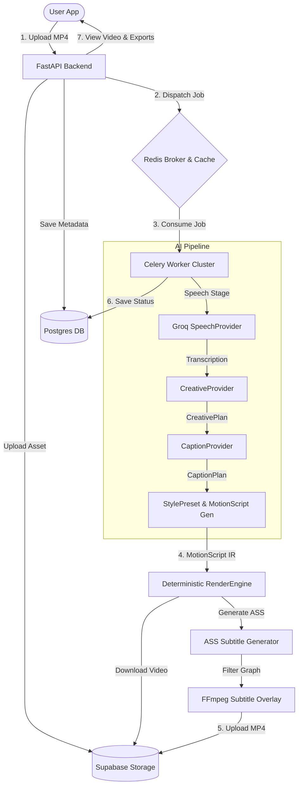

# MotionAI

MotionAI is a premium, production-ready AI-powered video editing and captioning SaaS platform. It automates speech transcription, creative pacing analysis, subtitle planning, styling, and deterministic high-fidelity rendering.

---

## 🏗️ Architecture Overview

The following diagram illustrates the flow of a video through the MotionAI orchestration pipeline, from upload to the final rendered output:



---

## 🚀 Developer Onboarding & Local Setup

Follow these steps to set up and run the entire stack locally:

### Prerequisites
* **Python**: 3.11.x
* **Node.js**: v18+ (with `pnpm`)
* **Databases**: PostgreSQL & Redis

### 1. Backend Setup
Navigate to the backend directory and set up a virtual environment:
```bash
cd apps/backend
py -3.11 -m venv .venv
.venv\Scripts\activate
pip install -r requirements.txt
```

Initialize your `.env` configuration:
```bash
cp .env.example .env
```
Run database migrations:
```bash
alembic upgrade head
```

Start the FastAPI application:
```bash
python -m uvicorn app.main:app --reload
```

### 2. Celery Worker Setup
Ensure Redis is running locally, then start the worker:
```bash
cd apps/backend
.venv\Scripts\activate
celery -A app.worker.celery_app worker --loglevel=info
```
To run periodic cleanups and recovery tasks, start Celery Beat:
```bash
celery -A app.worker.celery_app beat --loglevel=info
```

### 3. Frontend Setup
Install dependencies and run the development server:
```bash
pnpm install
pnpm dev
```

---

## 🔒 Production Hardening & Operations

### 1. Rate Limiting
To protect against DDoS and API abuse, `/api/v1` routes enforce a sliding-window rate limit:
* **Default**: `60 requests per minute` per user.
* **Mechanism**: Powered by Redis caching keys (`rate_limit:<user_id>`). Fails open safely if Redis becomes unreachable.

### 2. Automatic Resource Cleanups
* **Project Deletion**: When a project is soft-deleted, a background task (`motionai.cleanup_project_storage`) automatically purges its raw videos and rendered exports from Supabase Storage.
* **Export Lifecycles**: A daily beat task (`motionai.cleanup_old_exports`) removes exported videos older than 7 days, updating their status to `expired` to free up storage.
* **Stuck Job Recovery**: An hourly beat task (`motionai.recover_failed_jobs`) locates jobs stuck in `processing` for over 30 minutes, marks them as `failed` with timeout errors, and resets project states.

### 3. Worker Concurrency & Docker Settings
* **Concurrency**: Configured to `worker_concurrency=4` in `celery_app.py` for CPU/GPU balance.
* **Late Acks**: Configured with `task_acks_late=True` to ensure crashed worker tasks are automatically redelivered to other workers.

---

## 📝 Release Notes — v1.0.0 (Sprint 7)

### Added
* **Global Rate Limiter**: Implemented a Redis-backed FastAPI sliding-window rate limiter.
* **Background Storage Cleanup**: Added cascading cleanup workers executing on project deletions.
* **Periodic Retention Poller**: Implemented 7-day export storage expiration policies.
* **Stuck Job Recovery**: Added automated recovery checks for crashed or hung worker pipelines.
* **Frontend Health Dashboard**: Integrated an interactive system status indicator and modal detailing PostgreSQL database, Redis, and Celery worker uptime in the sidebar footer.
