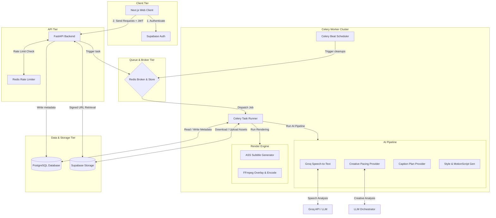
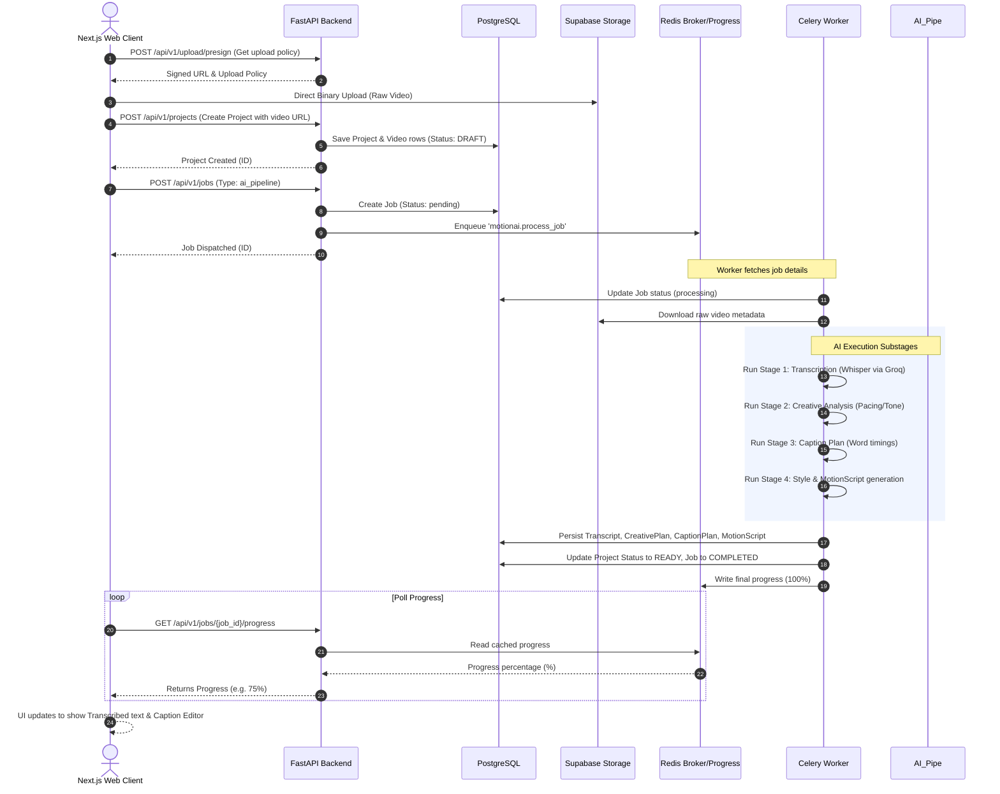
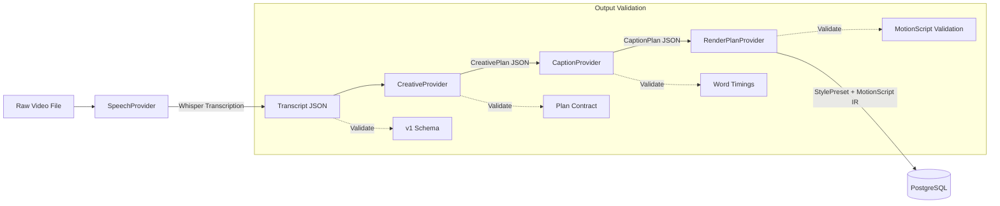
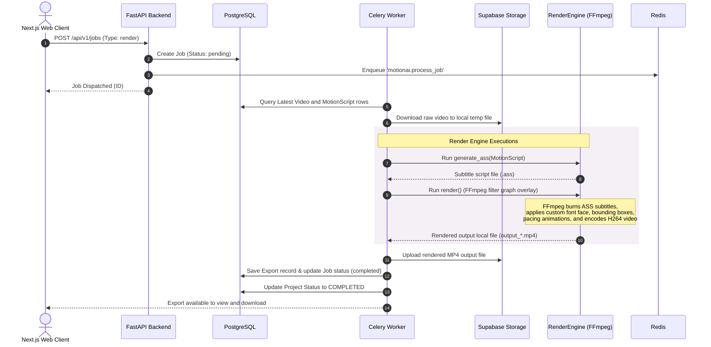
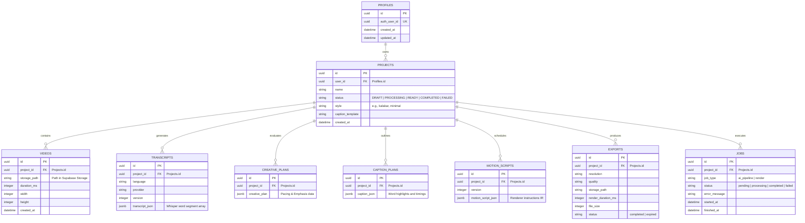

# MotionAI System Architecture & Workflow

This document provides a comprehensive, all-inclusive architectural and workflow specification for the **MotionAI** SaaS platform, mapping the interaction between the Next.js frontend, FastAPI backend, Redis brokers, Celery asynchronous processing workers, database models, and the deterministic rendering engine.

---

## 🏛️ System Topology

The system comprises five core architectural tiers:
1. **Client Tier**: Next.js (TypeScript, React, TailwindCSS) communicating with Supabase Auth for identity management, and the FastAPI API for orchestrating video project state.
2. **API Tier**: FastAPI (Python 3.11) exposing secure endpoints, enforcing Redis-backed sliding-window rate limiting, and updating metadata state in the PostgreSQL database.
3. **Queue & Broker Tier**: Redis cache serving as the Celery message broker, rate-limiter backend, progress-tracking repository, and distributed job-locking mechanism.
4. **Asynchronous Worker Tier (Celery)**: Parallel execution workers running:
   - **AI Orchestration Pipeline**: Whisper-based transcription, creative analysis, caption generation, and style compilation.
   - **Deterministic Rendering Engine**: Subtitle generation, FFmpeg burning, and video encoding.
   - **Scheduler (Beat) & Cleanup Pipelines**: Automated recovery, project deletion cleanup, and daily retention runs.
5. **Data & Storage Tier**: 
   - **PostgreSQL**: Relational database storing user profiles, projects, videos, transcripts, motion scripts, and jobs.
   - **Supabase Storage**: Object storage container hosting raw uploaded videos and final rendered export MP4s.



---

## 🔄 Core Workflows

### 1. End-to-End Video Processing & Upload Workflow

The sequence below illustrates the process when a user uploads a raw video, initiates AI transcription and design, edits styling, and exports the rendered video.



---

### 2. The AI Orchestration Pipeline

MotionAI enforces a strict contract-driven, step-by-step pipeline where the output of each AI provider maps to a structured JSON format and database schema.



---

### 3. The Deterministic Render Engine Workflow

When the user is satisfied with the edits (e.g. modified wording or style templates) and requests an export:



---

## 🧹 Background Maintenance & Reliability Operations

The platform uses scheduled Celery Beat tasks and transactional safeguards to maintain system cleanliness and handle failure states:

```mermaid
grid
    %% Grid layout representing maintenance tasks
```

### Stuck Job Recovery
- **Trigger**: Hourly poller (`motionai.recover_failed_jobs`).
- **Mechanism**: Queries `Job` table for runs stuck in `processing` state for $> 30\text{ minutes}$.
- **Resolution**: Resets job status to `failed` and transitions project status to `FAILED`, preventing hung processes from locking user interfaces.

### Project Cascading Storage Purge
- **Trigger**: Project deletion hook (`motionai.cleanup_project_storage`).
- **Mechanism**: Runs asynchronously to delete all raw user-uploaded videos and rendered export files stored under the project path `projects/{project_id}/` in Supabase Storage.

### Export Expiration Lifecycle
- **Trigger**: Daily runner (`motionai.cleanup_old_exports`).
- **Mechanism**: Sweeps database for exports created $> 7\text{ days}$ ago.
- **Resolution**: Deletes files from Supabase Storage and marks export database records as `expired` to manage cloud storage costs.

---

## 💾 Relational Data Schema Map

The core tables used to orchestrate the backend state machine:


