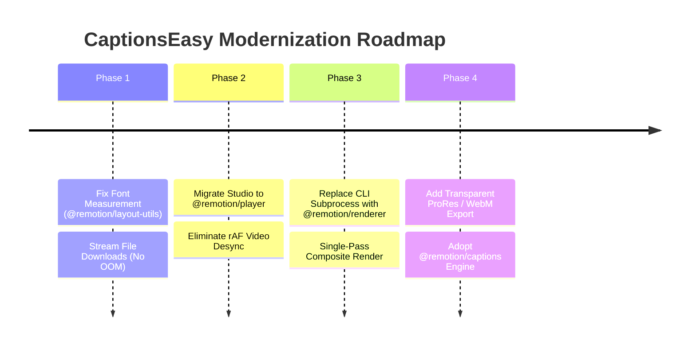

> **⚠️ SUPERSEDED by [CLAUDE.md](CLAUDE.md)** — kept for history until Phase 11. Do not follow the architecture below.

# CaptionsEasy Architectural Audit & Mega Renovation Plan (`comparision.md`)

> **Brutally Honest Engineering Review**: A comprehensive comparison of what currently exists, what is actually working, what is broken, the critical blunders, and the complete roadmap for a mega-renovation using Remotion's full ecosystem.

---

## 📑 Table of Contents
1. [Architectural Overview: Current State vs. Ideal State](#1-architectural-overview-current-state-vs-ideal-state)
2. [Detailed Component Comparison (Matrix)](#2-detailed-component-comparison-matrix)
3. [What Actually Works Today (Current Wins)](#3-what-actually-works-today-current-wins)
4. [What Does NOT Work or Is Severely Compromised](#4-what-does-not-work-or-is-severely-compromised)
5. [The Critical Blunders & Anti-Patterns (The Hall of Shame)](#5-the-critical-blunders--anti-patterns-the-hall-of-shame)
6. [Untapped Superpowers (What Could Be)](#6-untapped-superpowers-what-could-be)
7. [The Mega Renovation Blueprint (Phase-by-Phase)](#7-the-mega-renovation-blueprint)

---

## 1. Architectural Overview: Current State vs. Ideal State

```mermaid
graph TD
    subgraph "CURRENT ARCHITECTURE (Two-Pass Hybrid / Fragile)"
        A1[Client: HTML Video + rAF loop] -.->|Unpinned timeMs| B1[CaptionEngine.tsx Monolith]
        B1 -.->|Heuristic 0.56em font math| C1[Custom Drag Wrapper]
        D1[Backend Engine.py] -->|CLI Subprocess: npx remotion| E1[Temp ProRes 4444 MOV]
        E1 -->|CLI Subprocess: FFmpeg overlay merge| F1[Final Re-encoded MP4]
        G1[Local Worker] -->|Loads entire 500MB video into RAM| H1[Python httpx]
    end

    subgraph "IDEAL MODERN ARCHITECTURE (Remotion Native / High Performance)"
        A2[Client: Mediabunny Probing] --> B2[@remotion/player in Next.js]
        B2 -->|Real-time 60fps scrubbing| C2[Interactive.Div on Canvas]
        C2 -->|Exact canvas measureText| D2[@remotion/captions TikTok Pages]
        E2[Render Dispatch] -->|Node.js @remotion/renderer| F2[Single-Pass RenderMedia]
        F2 -->|Hardware NVENC / VideoToolbox| G2a[Instant Final MP4]
        F2 -->|Alpha Overlay Option| G2b[Transparent ProRes for Premiere]
        H2[Streaming File IO] -->|Zero RAM Buffering| E2
    end
```

---

## 2. Detailed Component Comparison (Matrix)

| Architectural Area | Current Implementation (`CaptionsEasy`) | Modern Standard (`Remotion 4.x Ecosystem`) | Status / Severity |
|---|---|---|:---:|
| **In-Browser Video Preview** | Custom `<video>` tag polled via `requestAnimationFrame` reading `video.currentTime * 1000`. | `@remotion/player` natively synced to video timeline with frame-accurate clamping. | ⚠️ **Janky Preview** |
| **Caption Synchronization** | Custom `SmoothCaptionOverlay` recalculating `timeMs` on every browser paint. | Native `<Sequence>` and `useCurrentFrame()` inside `@remotion/player`. | ⚠️ **Desync Risk** |
| **Word Pagination / Chunking** | Custom card chunker in `CaptionEngine.tsx` (`buildCardsFromTimeline`). | `@remotion/captions` -> `createTikTokStyleCaptions()` with adaptive token windows. | 🟡 **Suboptimal** |
| **Text Measurement & Auto-Fit** | Naive string length heuristic: `text.length * fontSize * 0.56`. | `@remotion/layout-utils`: Canvas-backed `measureText()` and `fitText()`. | 🔴 **CRITICAL BLUNDER** |
| **Canvas Interactivity** | Custom `DraggableCaptionWrapper` calculating mouse offsets and writing to state. | Native `remotion-interactivity` with `Interactive.Div` (drag handles, scale, rotation). | 🟡 **Reinventing Wheel** |
| **Render Execution** | Python `engine.py` calls `subprocess.run(["npx", "remotion", ...])` via CLI. | Node.js `@remotion/renderer` programmatic API (`renderMedia()`, `renderStill()`). | 🔴 **Performance Bottleneck** |
| **Render Pipeline** | **2-Pass Render**: Remotion renders ProRes 4444 `.mov` intermediate, then FFmpeg merges it. | **Single-Pass Render**: Remotion composites `<OffthreadVideo>` + captions directly into H.264. | 🔴 **Wasted Compute & Disk** |
| **Transparent Overlays** | Implemented as a temp internal intermediate, discarded after FFmpeg merge. | Exposed to creators as a high-value export feature for Premiere Pro / Final Cut. | 💡 **Missed Opportunity** |
| **Font Management** | Hardcoded TTF files + regex scraper parsing Google Fonts CSS2 in `fonts.ts`. | `@remotion/google-fonts` (`loadFont()` + `waitUntilDone()`). | 🟡 **Fragile Network Fetch** |
| **Media Probing** | Server-side FFprobe executed after full video upload. | Client-side `Mediabunny` (`remotion-multimedia`) before/during upload. | 💡 **UX Opportunity** |
| **Worker Memory Safety** | `video_resp.content` and `f.read()` load entire raw & output video files into Python RAM. | Streamed file chunks (`httpx.stream()` + disk writes). | 🔴 **OOM Crash Risk** |

---

## 3. What Actually Works Today (Current Wins)

Despite architectural inefficiencies, the following core features are working well:

1. **Groq Whisper Transcription Pipeline**:
   - Audio extraction to word-level timestamps is fast and reliable.
   - Stage validation via Pydantic contracts (`validate_motion_script`) works smoothly.
2. **Local Worker Tunneling (`pair.py` & Cloudflare)**:
   - Successfully bypasses cloud rendering RAM limits (Render/Vercel free tier) by delegating heavy jobs to the user's local CPU/GPU.
   - Pairing code workflow (`PANDA-2XA2`) connects the local worker to PostgreSQL state.
3. **ProRes 4444 Alpha Channel Fix**:
   - The team successfully diagnosed the WebM VP9 alpha bug and implemented ProRes 4444 (`yuva444p10le`), eliminating the black-box overlay glitch.
4. **Unified Styling Concept**:
   - Packaging `@motion-ai/caption-engine` as a monorepo package shared between `apps/frontend` and `apps/remotion-pipeline` was a great conceptual decision for WYSIWYG consistency.

---

## 4. What Does NOT Work or Is Severely Compromised

### 1. Preview vs. Export Frame Discrepancy (The WYSIWYG Illusion)
- In the Studio editor (`SmoothCaptionOverlay.tsx`), captions are driven by the browser's HTML5 `<video>` clock. If the video stutters, drops frames, or has audio sync delays, the caption animations stutter.
- In Remotion export (`apps/remotion-pipeline`), frames are calculated strictly at $1/30\text{s}$ intervals ($33.33\text{ms}$).
- **Result**: What the user sees in the editor does not 100% match what Remotion renders.

### 2. Catastrophic Font Fitting on Varied Typefaces
- Look at `packages/caption-engine/src/CaptionEngine.tsx` lines 94–96:
  ```ts
  export function estimateTextWidthPx(text: string, fontSizePx: number): number {
    return text.length * fontSizePx * 0.56;
  }
  ```
- **The Problem**: A character 'W' or 'M' in **Anton** or **Impact** is up to 3x wider than 'I' or 'l'. Emojis and punctuation have completely different metrics.
- **The Result**: Captions frequently wrap onto unwanted second lines or get clipped off-screen because the font fit heuristic underestimates actual text width.

### 3. Worker Out-Of-Memory (OOM) Crashes on Real Videos
- In `apps/backend/local_worker/run_job.py`:
  ```python
  video_resp = await http_client.get(video_signed_url)
  with open(video_local_path, "wb") as f:
      f.write(video_resp.content)  # Entire video buffered into RAM!
  ...
  with open(output_local_path, "rb") as f:
      output_bytes = f.read()      # Entire rendered video buffered into RAM!
  ```
- If a user uploads a 4K 60fps video (300MB–1GB), Python process memory spikes above 2GB, causing local workers on 8GB/16GB machines to crash or get killed by the OS.

---

## 5. The Critical Blunders & Anti-Patterns (The Hall of Shame)

### 🚨 Blunder #1: The Inefficient 2-Pass Render Workflow
Currently, rendering a 30-second video does this:
1. Spawns `npx remotion render Subtitles temp_overlay.mov --codec=prores --prores-profile=4444`.
2. Chromium renders every frame, compresses to a **multi-gigabyte ProRes 4444 intermediate video** on disk.
3. Spawns `ffmpeg -i input.mp4 -i temp_overlay.mov -filter_complex overlay output.mp4`.
4. FFmpeg decodes the input, decodes the huge ProRes file, blends them, and encodes a new H.264 MP4.
- **Why this is a blunder**: You are encoding **twice** and writing gigabytes of intermediate files to disk. Remotion can directly composite the background video using `<OffthreadVideo>` and render the final MP4 in **a single pass**, cutting render times in half!

### 🚨 Blunder #2: Calling `npx remotion` via CLI Subprocess
In `app/render/engine.py`, the backend runs:
```python
remotion_cmd = ["npx", "remotion", "render", ...]
subprocess.Popen(remotion_cmd, ...)
```
- Every single time a render runs, `npx` has to resolve dependencies, bootstrap Node.js, and parse CLI flags.
- **Modern Solution**: Use a lightweight Node.js worker service using `@remotion/renderer`'s native `renderMedia()` API, keeping the Puppeteer browser instance warm.

### 🚨 Blunder #3: Manual Google Fonts CSS Scraper in `fonts.ts`
`apps/remotion-pipeline/src/fonts.ts` contains 167 lines of custom HTTP fetching and regex parsing to parse Google Fonts CSS `@font-face` rules.
- If Google changes their CSS2 format or CDN response headers, renders fail silently and fall back to system Arial.
- **Modern Solution**: Use `@remotion/google-fonts`, which provides official, type-safe font preloading with zero regex hacks.

### 🚨 Blunder #4: Monolithic 1,100-line `CaptionEngine.tsx`
`packages/caption-engine/src/CaptionEngine.tsx` handles:
- Timeline parsing
- Font estimation
- Box layout calculations
- 15+ template rendering functions
- Entrance animations
- Highlight glow effects
- All inside one giant file. Any edit risks breaking every template simultaneously.

---

## 6. Untapped Superpowers (What Could Be)

By implementing the 12 Remotion skills installed in your workspace, CaptionsEasy can unlock features competitors charge $30/month for:

### 1. Instant Client-Side Video Probing (`remotion-multimedia`)
Using **Mediabunny** in Next.js:
- Detect aspect ratio (9:16 vs 16:9), duration, resolution, and audio sample rate **instantly** when the user drops a file, before upload even begins.

### 2. True Canvas Interactivity (`remotion-interactivity`)
- Wrap captions in `Interactive.Div`.
- Users can click and drag captions, rotate them at an angle, and resize text directly on top of the video canvas with native bounding boxes.

### 3. "Export Subtitles Only (Alpha)" Feature (`remotion-render`)
- Creators love editing in Premiere Pro / Final Cut / DaVinci Resolve.
- Add an export toggle: **"Download Transparent Captions (.mov / .webm)"**.
- Creators can drag the transparent animation directly into their timeline over color-graded footage!

### 4. Dynamic Font Auto-Sizing (`@remotion/layout-utils`)
- Using `fitText()`, long sentences automatically shrink slightly so words **never clip off the edges or break layout**.

---

## 7. The Mega Renovation Blueprint



### Phase 1: Immediate Safety & Accuracy (Days 1–2)
1. **Fix Worker RAM Buffering**:
   - In `apps/backend/local_worker/run_job.py`, rewrite `_run_render` to stream `http_client.stream("GET", ...)` directly to a file chunk-by-chunk. Never use `.content` or `f.read()`.
2. **Replace Font Heuristic with `measureText()`**:
   - Install `@remotion/layout-utils` in `@motion-ai/caption-engine`.
   - Replace `estimateTextWidthPx` with real canvas measurement.

### Phase 2: Preview Modernization (Days 3–4)
1. **Embed `@remotion/player` in `apps/frontend`**:
   - Replace `<video>` + `SmoothCaptionOverlay` with `@remotion/player`.
   - Pass `CaptionComposition` directly to the player.
   - Achieve 100% pixel-perfect WYSIWYG scrubbing with zero audio/clock drift.

### Phase 3: Single-Pass Render Engine (Days 5–6)
1. **Eliminate the Double-Pass FFmpeg Intermediate**:
   - Create a unified `VideoWithCaptions` composition in `apps/remotion-pipeline`:
     ```tsx
     <AbsoluteFill>
       <Video src={props.videoUrl} />
       <Subtitles {...props} />
     </AbsoluteFill>
     ```
   - Render the final MP4 in **one single pass** via `@remotion/renderer`.
   - Save 50% render time and gigabytes of disk I/O.

### Phase 4: Pro Features & Polish (Days 7+)
1. **Add Transparent Overlay Export Mode**:
   - Give users the option to download the raw ProRes 4444 `.mov` or WebM `.webm` overlay.
2. **Clean Font Loading**:
   - Replace `fonts.ts` regex parsing with `@remotion/google-fonts`.
3. **Deconstruct `CaptionEngine.tsx`**:
   - Split into `engine/layout.ts`, `engine/templates/`, and `engine/animations.ts`.

---

*This document is the master architectural assessment and renovation blueprint for CaptionsEasy.*
