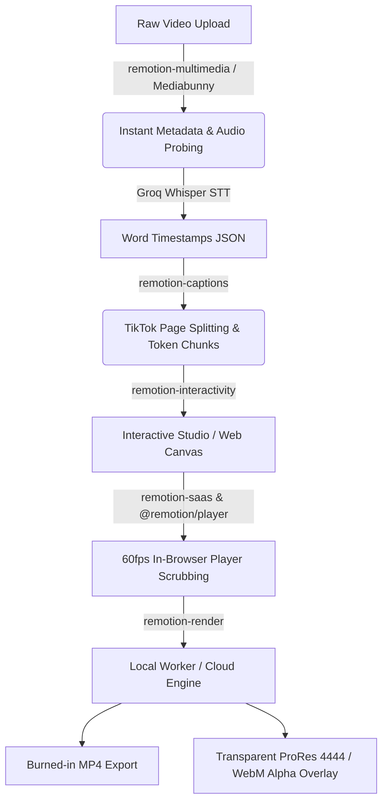

# CaptionsEasy Architecture & Remotion Skills Guide (`remotion2.md`)

> **Beyond Basic Text Formatting**: How the 12 newly installed Remotion Skills transform CaptionsEasy into an industry-leading, interactive AI Kinetic Subtitles SaaS.

---

## 🧭 Executive Summary: The Skill Ecosystem

In [`remotion.md`](remotion.md), we explored the raw CSS and frame-level mechanics of text. 

However, building a commercial SaaS like **CaptionsEasy** (competing with Captions.ai, Submagic, and OpusClip) requires an entire production pipeline: instant video probing, word-level audio synchronization, interactive on-canvas dragging in the web browser, real-time timeline scrubbing, and zero-loss transparent video exports.

The 12 newly installed Remotion skills provide the exact blueprint for this pipeline:



---

## 🏆 Which Skills Produce the "Best Captions" & Why

Here is the strategic breakdown of the 12 skills, ranked by their direct impact on CaptionsEasy:

| Skill | Superpower for CaptionsEasy | Priority |
|---|---|:---:|
| **1. `remotion-captions`** | **The Brain**: Whisper to TikTok-style word pagination, token timing, and SRT import/export. | 🟢 **Core Engine** |
| **2. `remotion-interactivity`** | **The User Experience**: Makes text elements on the video canvas clickable, draggable, scalable, and keyframe-editable. | 🟢 **Core Feature** |
| **3. `remotion-saas`** | **The Web Architecture**: Embeds `@remotion/player` inside Next.js with reactive React state, dynamic metadata, and render queues. | 🟢 **Core Architecture** |
| **4. `remotion-render`** | **The Pro Feature**: Exports transparent alpha-channel overlays (`.mov` ProRes 4444 and `.webm` VP9) for Premiere Pro / DaVinci Resolve creators. | 🟡 **High Value** |
| **5. `remotion-multimedia`** | **Instant Browser Probing**: Uses Mediabunny for lightning-fast client-side audio/video dimension and duration extraction without FFmpeg lag. | 🟡 **High Value** |
| **6. `remotion-markup`** | **Kinetic Typography Design**: Guarantees frame-deterministic animations, path morphing, and strict separation of transforms. | 🟡 **Design Quality** |
| **7. `remotion-studio`** | **Dev Velocity**: Local preview server with real-time prop inspector, timeline zoom, and hot reloading. | ⚪ **Workflow** |
| **8. `remotion-best-practices`** | **Stability**: Enforces zero-glitch rules, font preloading, and caching policies. | ⚪ **Guardrails** |
| **9. `remotion-upgrade`** | **Maintenance**: Keeps `@remotion/*` dependencies in lockstep across monorepo packages. | ⚪ **Maintenance** |
| **10. `remotion-create`** | Scaffolding new compositions, templates, and boilerplates. | ⚪ **Utilities** |
| **11. `remotion-docs`** | Direct access to official Remotion documentation. | ⚪ **Reference** |
| **12. `remotion-maps`** | Geospatial map animations (for travel/documentary caption templates). | ⚪ **Niche Templates** |

---

## 🛠️ Deep Dive: How to Leverage the Top 5 Skills

---

### 1. `remotion-captions`: Whisper Alignment to Dynamic Word Paging

Raw transcription produces a flat stream of words. Great social captions (Hormozi, MrBeast, TikTok) display **only 1 to 3 words at a time**, timed to speech rhythm.

#### The Secret: `combineTokensWithinMilliseconds`
`@remotion/captions` gives you `createTikTokStyleCaptions()`, which automatically paginates continuous Whisper timestamps into screen chunks:

```tsx
import { useMemo } from "react";
import { createTikTokStyleCaptions, Caption } from "@remotion/captions";

interface CaptionEngineProps {
  whisperTokens: Caption[];
  pacingMode: "fast" | "normal" | "slow";
}

export const usePaginatedCaptions = ({ whisperTokens, pacingMode }: CaptionEngineProps) => {
  // Pacing control:
  // Fast (Hormozi / Shorts): ~800ms window (1-2 words per screen)
  // Normal (TikTok / Reels): ~1400ms window (3-5 words)
  // Slow (Podcasts / Educational): ~2200ms window (full phrase)
  const windowMs = pacingMode === "fast" ? 800 : pacingMode === "normal" ? 1400 : 2200;

  const { pages } = useMemo(() => {
    return createTikTokStyleCaptions({
      captions: whisperTokens,
      combineTokensWithinMilliseconds: windowMs,
    });
  }, [whisperTokens, windowMs]);

  return pages;
};
```

#### Synchronizing Each Page with Remotion `<Sequence>`
```tsx
import { Sequence, useVideoConfig, AbsoluteFill } from "remotion";

export const CaptionsTrack = ({ pages }: { pages: ReturnType<typeof usePaginatedCaptions> }) => {
  const { fps } = useVideoConfig();

  return (
    <AbsoluteFill>
      {pages.map((page, index) => {
        const nextPage = pages[index + 1] ?? null;
        const startFrame = Math.round((page.startMs / 1000) * fps);
        const endFrame = Math.round(
          (nextPage ? nextPage.startMs / 1000 : (page.tokens[page.tokens.length - 1].toMs + 300) / 1000) * fps
        );
        const durationInFrames = Math.max(1, endFrame - startFrame);

        return (
          <Sequence key={index} from={startFrame} durationInFrames={durationInFrames} layout="none">
            <ActiveCaptionPage page={page} />
          </Sequence>
        );
      })}
    </AbsoluteFill>
  );
};
```

---

### 2. `remotion-interactivity`: On-Canvas Drag, Drop & Resize

Users don't just want hardcoded subtitles; they want to **drag the caption box** to avoid covering a speaker's face, resize it, or adjust rotation directly on screen.

Using `remotion-interactivity`, you replace generic `<div>` with `Interactive.Div`:

```tsx
import { Interactive, useCurrentFrame, useVideoConfig, interpolate, Easing } from "remotion";
import type { TikTokPage } from "@remotion/captions";

export const InteractiveCaptionBox: React.FC<{ page: TikTokPage }> = ({ page }) => {
  const frame = useCurrentFrame();
  const { fps } = useVideoConfig();

  // Rules from remotion-interactivity:
  // 1. Keep CSS styles inline in the style prop (no constants or spreads)
  // 2. Animate scale, translate, rotate separately (avoid compound `transform` string)
  // 3. Keep easing inline
  return (
    <Interactive.Div
      name="Subtitles Overlay"
      style={{
        position: "absolute",
        bottom: "18%",
        left: "10%",
        width: "80%",
        textAlign: "center",
        // Visual editing enabled in Studio / Interactive Canvas:
        scale: interpolate(frame, [0, 6], [0.85, 1], {
          easing: Easing.spring({ damping: 14, stiffness: 220 }),
          extrapolateLeft: "clamp",
          extrapolateRight: "clamp",
        }),
      }}
    >
      {page.tokens.map((token) => (
        <span key={token.fromMs} style={{ fontSize: 56, fontWeight: 900, color: "white" }}>
          {token.text}{" "}
        </span>
      ))}
    </Interactive.Div>
  );
};
```

**Why this is huge for CaptionsEasy:**
- In the Remotion Studio or Remotion Player, the user can click directly on the text box.
- Bounding boxes appear with drag handles.
- Position, scale, and rotation are automatically written back to props.

---

### 3. `remotion-saas`: Web Player Embedding & Dynamic Metadata

In a web application like Next.js (`apps/frontend`), you need an instantaneous video preview that scrubs at 60 FPS without waiting for backend video renders.

#### The Client-Side `<Player>` Integration:
```tsx
"use client";

import { useRef, useState } from "react";
import { Player, PlayerRef } from "@remotion/player";
import { CaptionComposition } from "@/remotion/CaptionComposition";

export const VideoPreviewEditor = ({ videoUrl, transcriptTokens, stylePreset }) => {
  const playerRef = useRef<PlayerRef>(null);
  const [currentFrame, setCurrentFrame] = useState(0);

  return (
    <div className="relative w-full max-w-[400px] aspect-[9/16] rounded-2xl overflow-hidden border border-white/10 shadow-2xl">
      <Player
        ref={playerRef}
        component={CaptionComposition}
        inputProps={{
          videoUrl,
          transcriptTokens,
          stylePreset,
        }}
        durationInFrames={30 * 15} // e.g. 15 seconds @ 30fps
        fps={30}
        compositionWidth={1080}
        compositionHeight={1920}
        style={{ width: "100%", height: "100%" }}
        controls
        autoPlay={false}
        loop
      />
    </div>
  );
};
```

#### Dynamic Metadata (`calculateMetadata`):
Instead of hardcoding 15 seconds or 1080x1920, the composition calculates its own dimensions and frame count directly from the uploaded video:

```tsx
import { CalculateMetadataFunction } from "remotion";

export const calculateVideoMetadata: CalculateMetadataFunction<CompositionProps> = async ({ props }) => {
  // Probe video file metadata dynamically
  return {
    durationInFrames: Math.ceil(props.durationSeconds * 30),
    width: props.aspectRatio === "9:16" ? 1080 : 1920,
    height: props.aspectRatio === "9:16" ? 1920 : 1080,
    props: {
      ...props,
    },
  };
};
```

---

### 4. `remotion-render`: Transparent Alpha Overlays (The Creator Secret)

Many professional video creators on YouTube and TikTok edit in **Premiere Pro**, **Final Cut Pro**, or **CapCut**. They do not want the SaaS to re-encode and compress their original 4K video.

**They only want the subtitles as a transparent overlay video!**

`remotion-render` documents how to render transparent videos with alpha channels:

#### 1. Transparent ProRes 4444 (`.mov`) — For Mac / Premiere / Final Cut
```bash
npx remotion render CaptionsOnlyComposition out/captions_alpha.mov \
  --codec=prores \
  --prores-profile=4444 \
  --pixel-format=yuva444p10le \
  --image-format=png
```

#### 2. Transparent WebM VP9 (`.webm`) — For Browser & Web Editors
```bash
npx remotion render CaptionsOnlyComposition out/captions_alpha.webm \
  --codec=vp9 \
  --pixel-format=yuva420p \
  --image-format=png
```

#### Programmatic Implementation in `local_worker/renderer.py`:
You can configure Remotion to export transparent video directly when the user toggles **"Export Subtitle Overlay Only"**:

```tsx
// Inside Remotion calculateMetadata
export const calculateMetadata: CalculateMetadataFunction<Props> = async ({ props }) => {
  if (props.exportAlphaOnly) {
    return {
      defaultCodec: "prores",
      defaultProResProfile: "4444",
      defaultPixelFormat: "yuva444p10le",
      defaultVideoImageFormat: "png",
    };
  }
  return {
    defaultCodec: "h264",
    defaultPixelFormat: "yuv420p",
  };
};
```

---

### 5. `remotion-multimedia`: Lightning Browser Probing via Mediabunny

Before user videos are processed or rendered, you need to know:
- Exact video duration (to the millisecond)
- Native width & height (to detect 9:16 vs 16:9 automatically)
- Audio sample rate & channels

Usually developers run heavy FFmpeg processes on the server. **Mediabunny** (`https://mediabunny.dev`) runs client-side in the browser:

```tsx
import { getAudioDuration, getVideoDimensions, getVideoDuration } from "./mediabunny-helpers";

// In apps/frontend upload handler:
const handleFileSelected = async (file: File) => {
  // 1. Get exact dimensions instantly
  const { width, height } = await getVideoDimensions(file);
  const detectedAspectRatio = width < height ? "9:16" : "16:9";

  // 2. Get exact duration in seconds
  const duration = await getVideoDuration(file);

  console.log(`Video is ${width}x${height} (${detectedAspectRatio}), duration: ${duration}s`);
  // Update UI immediately before upload finishes!
};
```

---

## ⚡ The Full CaptionsEasy Production Pipeline

By synthesizing these skills, CaptionsEasy operates as follows:

```
[User drops video in Web UI]
         │
         ▼
1. Mediabunny (remotion-multimedia)
   -> Extracts width, height, FPS, and duration instantly in browser.
         │
         ▼
2. Backend Groq Whisper API
   -> Transcribes audio to word-level timestamps (JSON format).
         │
         ▼
3. @remotion/captions Engine (remotion-captions)
   -> Groups timestamps into TikTok-style pages (800ms - 1500ms chunks).
         │
         ▼
4. Remotion Interactive Player (remotion-saas + remotion-interactivity)
   -> Next.js renders @remotion/player.
   -> User scrubs timeline at 60fps.
   -> User drags captions box, changes colors, font size, and kinetic styles.
         │
         ▼
5. Local Worker Dispatch (remotion-render)
   -> Option A: Burned-in MP4 with background video (H.264/AAC).
   -> Option B: Transparent ProRes 4444 MOV with Alpha (for Premiere/FCP).
```

---

## 🎯 Action Items for CaptionsEasy

1. **Install Core Remotion Packages in the Monorepo**:
   ```bash
   pnpm add @remotion/captions @remotion/layout-utils @remotion/player @remotion/paths
   ```
2. **Implement `createTikTokStyleCaptions()`**:
   - In `apps/backend/app/render/`, connect Whisper output directly to `@remotion/captions` pagination.
3. **Offer "Transparent Subtitles" Export**:
   - Add a toggle in the Export modal: `Burn into Video` vs `Transparent ProRes (.mov) for Premiere Pro`. This is a premium selling point that sets CaptionsEasy apart from generic caption tools!

---

*This document complements [`remotion.md`](remotion.md) and serves as the architectural reference for CaptionsEasy.*
